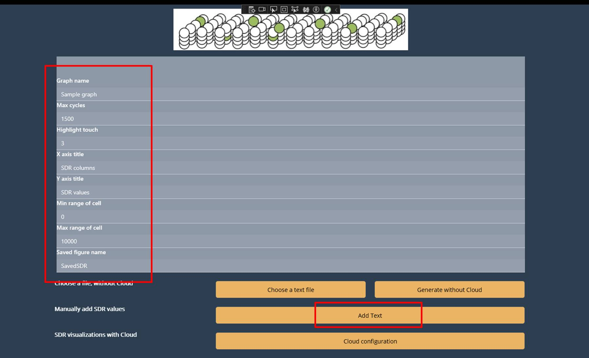
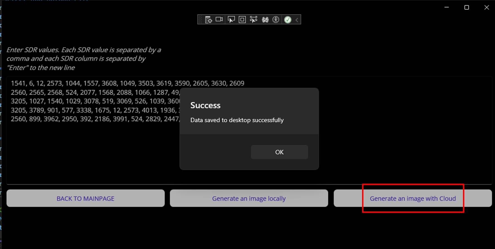

# ML22-23-8 Implement the SDR representation in the MAUI application - Azure Cloud Implementation

This project requires the implementation of the SE Project topic "ML22-23-8 Implement the SDR representation in the MAUI application" onto the cloud computing platform. Microsoft Azure is the core platform for constructing and building the web App SDR application. Azure provides the data storage, letting the app store inputs and outputs in a container or queue, and show how the app could utilize the Azure's services.

## Table of contents
1. [Introduction](#introduction)
2. [Important Project Links](#important-project-links)
    * [SE Project links](#se-project-links)
    * [Cloud Project links](#cloud-project-links)
3. [Goal of Cloud Project](#goal-of-cloud-project)
4. [Overview of the cloud architecture](#overview-of-the-cloud-architecture)
5. [Implementation of new properties in AppSDR](#implementation-of-new-properties-in-appsdr)
    * [UI implementation](#ui-implementation)
    * [Logic implementation](#logic-implementation)
6. [Experiment and evaluation](#experiment-and-evaluation)
    * [How to run experiment](#how-to-run-experiment)
    * [Blob Container Registry](#blob-container-registry)
    * [Evaluation](#evaluation)
7. [Conclusion](#conclusion)

## Introduction
AppSDR is the .NET MAUI app visualizing the Sparse Distribution Representations (SDR) with the user's SDR values and drawing specifications. The map's primary functions are taking the parameters for graph visualization, and the SDR values with local files or manually set. For Cloud implementation on the AppSDR, the following are created.

* Modify the original pages with new variables and properties to navigate to a new page.
* Add a new *UploadPage* to handle the cloud properties, with new UI elements to specify the pointed Azure data objects (Storage Account, Blob, Queue, and Table Storage).
* Add two new classes to handle the *Message operation* functions, working as the automatic generation when users want outputs with the Azure platform.

The new version of AppSDR can be operated manually and automatically, depending on users' purpose. This project mainly works on Azure Storage Account. Dockers and Azure Services are not included in this implementation.

## Important Project Links
### SE Project links
1. SE Project Documentation: [PDF](../../MySEProject/Documentation/ML22-23-8-Implement%20the%20SDR%20representation%20in%20the%20MAUI%20application_MAUI_App_SDR-Paper.pdf)<br/>
2. README files: [Description](../../MySEProject/Documentation/Readme.md), [User Manual](../../MySEProject/Documentation/UserManual.md)
3. Implemented classes: [MainViewModel()](../../MySEProject/AppSDR/ViewModel/MainViewModel.cs), [Page1ViewModel()](../../MySEProject/AppSDR/ViewModel/Page1ViewModel.cs), [MainPage()](../../MySEProject/AppSDR/MainPage.xaml.cs), [TextEditorPage()](../../MySEProject/AppSDR/TextEditorPage.xaml.cs), [Page1()](../../MySEProject/AppSDR/Page1.xaml.cs)<br/>
4. SDR drawing library: [SdrDrawerable()](../../MySEProject/AppSDR/SdrDrawerLib/SdrDrawable.cs)<br/>
5. Sample SDR inputs: [Folder](../../MySEProject/Documentation/TestSamples/)

### Cloud Project links
1. Cloud Project Documentation: [Experiment Specification](./Experiment%20Specification%20-%20Anh%20Tong%20Ngoc%20Minh%20-%20Son%20Pham%20Tien.md)
2. Other README file: [User Manual](User%20Manual.md)
3. UI implemenation of Cloud Configuration Page: [UploadPage.cs](../AppSDR/UploadPage.xaml)
4. Logic implementation class of Cloud Configuration Page: [UploadPage()](../AppSDR/UploadPage.xaml.cs), [UploadViewModel()](../AppSDR/ViewModel/UploadViewModel.cs)
5. Message handle class: [ExperimentRequestMessage()](../AppSDR/ExperimentRequestMessage.cs), [QueueMessageListener()](../AppSDR/QueueMessageListener.cs)
6. Project solution: [MyCloudProject.sln](../MyCloudProject.sln)

## Goal of Cloud Project
Microsoft Azure is an open and flexible cloud-computing platform. The scope of this project is to apply Azure Cloud to the Software Project of .NET MAUI (AppSDR), using Azure storage containers for storing inputs and outputs of the app. In general, the project involves:

* Modifying the current .NET MAUI app to access the Azure storage account. The main idea is to create the *BlobStorageService* class, holding the input storage account information, and which type of storage is used. 
* Creating a new page with new functions to interact with the Azure storage account, including uploading and downloading files. Users on this page specify the storage information calling the *BlobStorageService* to access the provided storage account.
* Adding a button for *Listening Mode* which waits for messages indicating that CSV files are ready for processing in a specified container. Users can manually upload messages, and when ready, a message can be sent programmatically. The app initiates file processing on-demand without waiting for the message, ensuring flexibility in operation.

AppSDR is operated locally, not dockerized, to receive the user's input interaction. The app accesses the specific cloud storage and saves the user's input. The SDR representation is saved on the storage and can be downloaded to the local machine.

## Overview of the Cloud Architecture
The Cloud Architecture describes the relationship among the object-based Cloud storages. The figure has green components illustrating the manual generation, and the orange ones for automatic generation.

<div style="background-color: #ffffff; text-align:center">
  </img>
</div><br>

This project involves Azure Containers carrying the uploaded data and retrieving it using the corresponding feature from AppSDR. The storage specification for each generating method must follow:

* Users can only use the manual method when *Storage Account 1* is connected. Then users' SDR parameters inputs are uploaded and stored in the *Table Container*, and the SDR files are in the *Blob Storage*. When generation is started in AppSDR, the app retrieves the most recent entity from the *Table* and the values of all files in *Blob* to draw the outputs. The outputs are stored in the *Output Blob*.

* For automatic method, users provide information to connect *Storage Account 2*, and upload the *MESSAGE* to a defined *Queue Container*. This MESSAGE* contains the Connection String of *Storage Account 2*, along with its attending containers. When AppSDR listens to the MESSAGE in Queue, the output generation starts. The process includes: taking parameters, taking files, drawing outputs, and uploading outputs to Blob. 

* *Storage Account 2* can be different from 1, or user can make use of *Storage Account 1* to store Queue MESSAGE.

## Implementation of new properties in AppSDR
The primary AppSDR's architecture from the SE Project remains, adding the Cloud-configuration *Upload Page*, and additional functions in existing pages to handle Azure Cloud components. The visualization for the new application described in the figure below has black and blue components representing the original AppSDR and red components for the Cloud Project implementation.

<div style="background-color: #ffffff; text-align:center">
  </img>
</div><br>

The new properties are implemented with the following specifications.

* Besides the specified inputs in the SE project to *Main Page*, a new handling place is created to take the *Message Configuration* used for automatic SDR visualization generation. This input is optional, so when users want to proceed with the operation manually, they can ignore this input area.
* A New *Upload Page* is created to take *Cloud Configuration* for Cloud accession. *Upload Page* is navigable from *Main Page, Text Editor Page*, and points to *Page 1*. This page calls additional classes to proceed with the *Message* from *Main Page*.

The *xaml* code for the addition is based on the original AppSDR, reviewed on the previous [Readme](../../MySEProject/Documentation/Readme.md). Details on UI and Logic implementation new configuration and steps are explained in the next subsections. 

### UI implementation
AppSDR remains the primary UI foundation, adding a new *Upload Page* defined as the following diagrams. For the initial pages, new arrangements are applied with new old and additional components.

<div style="background-color: #ffffff; text-align:center">
  </img>
</div><br>

The content and navigation of the UI elements of *Page 1* remains as in SE Project. While the existing *Main Page* and * Text Editor Page* have added components, following the configurations below.
* In *Main Page*, SDR picture and parameters inputs table stay the same. *Labels* are added to specify the button functions, corresponding to the same-line buttons. 
* A block of Message Configuration is added for users to provide *Storage Account* information and *MESSAGE*, accessing and uploading to the *Queue Container*. A new button is added to handle this block.
* Instead of *Entry*, AppSDR uses *Editor to carry this block inputs, as the content might be too long just for the *Entry* visualization.
* In *Text Editor Page*, one button is added, carrying the navigation to *Upload Page*.

The new *Upload page* contains two parts: the left one for Cloud configuration and the right parts for the actual operating functions, described in the next points: 
* Configure Storage: This section likely provides controls (buttons, text fields) to configure storage settings, such as connection strings or storage account details for Azure.
* Configure Blob & Table: Similar to storage configuration, but specifically for configuring Azure Blob Storage and Table Storage. This might involve selecting or creating containers and tables.
* Status: Displays the current status of operations, such as storage configuration, upload status, or connection status.
* Manual Generation: Controls to manually trigger the generation of messages or data that will be uploaded or processed.
* Message Generation: Controls related to automating or managing the generation of messages that the system will process or upload.
* Message Status: A display area showing the status of the messages being handled by the system, possibly indicating success, failure, or progress.

*Upload Page* has two panels for two applications, so the *Layout* must be combined. The left panel components fit in the preview size of the AppSDR, so the *StackLayout* is used. For the right panel, the components may exist in the area, so the *ScrollView* is used, with the *StackLayout* inside. Both of the panels are on the *Grid* to restrain the UI elements and are better to modify.

```xaml
    <Grid RowDefinitions="Auto,*" ColumnDefinitions="250,*,*,*,*,*">
        <!-- Left Panel with Storage Configuration Options -->
        <StackLayout Grid.Row="0" Grid.Column="0" Grid.RowSpan="2"
                     BackgroundColor="{StaticResource LeftPanelBackgroundColor}"
                     Padding="10" Spacing="10">     
        </StackLayout>

        <!-- Right Panel with SDR Visualization -->
        <ScrollView Grid.Row="0" Grid.Column="1" Grid.ColumnSpan="5"
                    BackgroundColor="{StaticResource RightPanelBackgroundColor}"
                    Padding="10">
            <StackLayout Spacing="20">
                <Label Text="GENERATE SDR VISUALIZATION" 
                       FontAttributes="Bold" 
                       TextColor="{StaticResource PrimaryTextColor}" />
            </StackLayout>
        </ScrollView>
    </Grid>
```
### Logic implementation
The logic implementation remains unchanged for *MainPage(), Page1ViewModel()*. Other classes have configurations to handle new variables and functions on Cloud elements, especially the *UploadPage(), UploadViewModel(), QueueMessageListener(), ExperimentRequestMessage(), and TableEntityConfiguration()*. As the AppSDR accesses to Blob, Queue and Table containers, the mentioned packages must be included for the app to operate.

```csharp
using Azure.Data.Tables;
using Azure.Storage.Blobs;
using Azure.Storage.Queues;
```

First, the *MainViewModel()* is described as new functions and binding context is added. The binding context stores the information of the Queue Container and the MESSAGE used for *Message generation*. Other function is summarized as:
* *AddText()*: Prepare and navigate to a *Text Editor Page* with the necessary configuration and user-provided values.
* *NavigateToUploadPage()*: Navigate to the *Upload Page* with parameters, and handles any navigation errors.
* *UploadMessage()*: Handles sending a message to an Azure queue and updates message configuration, with error handling.
* *SendMessageToQueue()*: Manages the creation of the queue if needed, sends a message, and provides feedback on success or failure.

In *TextEditorPage()*, a new function is added to transform the entered SDR values into a .txt file, and save it to Desktop. Then, AppSDR navigates to *Upload Page* with parameters taken from *Main Page* and the text file. The main property is to save values into a file, as in the code snippet below.

```charp
                // Get the path to the user's desktop directory
                string desktopPath = Environment.GetFolderPath(Environment.SpecialFolder.Desktop);

                // Define the file name and full path
                string fileName = "SavedSDR.txt";
                string filePath = Path.Combine(desktopPath, fileName);

                // Write the content to the file
                File.WriteAllText(filePath, fileContent);
```

*UploadPage()* is defined similar to *MainPage()*. Details can be checked in SE project [Readme](../../MySEProject/Documentation/Readme.md). Relations and functions are specified in *UploadViewModel*. The important variables (or inputs) *Upload Page* must analysized are:
```csharp
public INavigation Navigation { get; set; }
public string AssignedTextFilePath { get; set; }
public string[] MessageConfig { get; set; }
public List<string> SelectedFiles { get; set; }
public string[] EntryCellValues { get; set; }
public string ConnectionString { get; set; }
public string StorageAccount { get; set; }
public bool IsConnected { get; set; }
public string UploadBlobStorageName { get; set; }
public string DownloadBlobStorageName { get; set; }
public string TableStorageName { get; set; }
public string StatusMessage { get; set; }
public string ListenMessage { get; set; }
```

* *SelectAndUploadFileAsync()* handles file selection and upload to Azure Blob Storage, only executable if CanExecuteCommands returns true.
* *DownloadFilesAsync()* manages the download of files from Azure Blob Storage, enabled only when command configurations conditions are met.
* *OnConnectAsync()* initiates the connection to Azure services and updates the connection status.
* *UploadParameters()* uploads experiment parameters to Azure Table Storage, executable if connection parameters are valid and *EntryCellValues* are not null.
* *GenerateOutput()* processes blobs from Azure Blob Storage and navigates to a new page for visualization, only executable if commands can be executed based on the connection status.
* *StartListening()* starts listening for messages from an Azure Queue, enabled if MessageConfig is properly configured.
* *StopListening()* stops the message listening process initiated by StartListeningCommand.

Next, *Page1()* is discused. The foundational functions are kept, while a new task is applied to handle multiple visualizations and connect to Azure Cloud Storage.
* The *SaveScreenshotToBlobStorage* function captures the current screen, names the file with a timestamp (optionally including an identifier), and uploads it to Azure Blob Storage. After the upload, it informs the user of success with an alert. If the screenshot capture fails, an error message is shown instead.
```csharp
    public async Task SaveScreenshotToBlobStorage()
    {
        // Capture the screenshot
        IScreenshotResult screenshotResult = await DrawableView.CaptureAsync();

        if (screenshotResult != null)
        {
            using (var stream = await screenshotResult.OpenReadAsync())
            {
                // Generate a unique file name using a timestamp
                string timestamp = DateTime.UtcNow.ToString("yyyyMMddHHmmssfff");
                string blobName;

                if (_entryCellValues[7] != null)
                {
                    blobName = $"{_entryCellValues[7]}_{timestamp}.png";
                }
                else
                {
                    blobName = $"{timestamp}.png";
                }

                BlobServiceClient blobServiceClient = new BlobServiceClient(_connectionString);
                BlobContainerClient containerClient = blobServiceClient.GetBlobContainerClient(_downloadBlobStorage);
                BlobClient blobClient = containerClient.GetBlobClient(blobName);

                await blobClient.UploadAsync(stream, new BlobHttpHeaders { ContentType = "image/png" });
                // Optional delay before the next operation
                await DisplayAlert("Success", "Screenshot has been saved successfully.", "OK");
            }
        }
        else
        {
            // Display a message if no screenshot was captured
            await DisplayAlert("Error", "Failed to capture screenshot.", "OK");
        }
    }
```

The *Message generation* uses *QueueMessageListener.cs* with the corresponding class to access and process the MESSAGE. The class includes:
* *ListenToMessagesAsync()* function: Continuously listens to an Azure Queue for messages, deserializes them into ExperimentRequestMessage objects, and processes each one. It handles errors and displays alerts for issues.
* *ProcessExperimentRequestAsync()* function: Download and process blobs from Azure Blob Storage based on an experiment request. It reads and parses blob content then navigates to *Page 1* for data visualization.
* *DownloadBlobToFileAsync()* function: Download a blob to a local file and save it. Alerts the user if any errors occur during the download.
* *ProcessDownloadedFileAsync()* function: Read and parse the downloaded file, retrieves additional configuration from Azure Table Storage, and navigates to *Page 1* for further processing. The task uses the above downloaded files and goes through all files.
* *DownloadEntity()* function: Retrieve all entity configurations from Azure Table Storage and return them as an array of strings.
* *ParseFileContent()* function: Convert file content into a 2D integer array, filtering out empty or irrelevant rows, to be used for further processing.
* *IsBase64String()* function: Checks if a string is valid Base64, useful for decoding messages.
* *SanitizeFileName()* function: Replaces invalid characters in file names with underscores to ensure they are safe for saving locally.

The *ExperimentRequestMessage()* handles the MESSAGE retrieved from the Queue Container. The following four variables must be in MESSAGE to make *QueueMessageListener()* valid.

```csharp
namespace AppSDR
{
    public class ExperimentRequestMessage
    {
        public string StorageConnectionString { get; set; }
        public string UploadBlobStorageName { get; set; }
        public string DownloadBlobStorageName {  get; set; }
        public string TableStorageName { get; set; }
    }
}
```
The *TableEntityConfiguration()* handles the entity corresponding to each defined parameters. This class is called when user want to upload or download the eight parameters to or from the Table Container.

```csharp
using Azure;
using Azure.Data.Tables;

namespace AppSDR
{
    // Class handles table entities when working with Table Storage
    public class TableEntityConfiguration : ITableEntity
    {
        public string PartitionKey { get; set; }
        public string RowKey { get; set; }
        public string GraphName { get; set; }
        public string MaxCycles { get; set; }
        public string HighlightTouch { get; set; }
        public string XaxisTitle { get; set; }
        public string YaxisTitle { get; set; }
        public string MinRange { get; set; }
        public string MaxRange { get; set; }
        public string SavedName { get; set; }
        public DateTimeOffset? Timestamp { get; set; }
        public ETag ETag { get; set; }
    }
}
```

## Experiment and evaluation
The four cases are considered to observe the benefit of Azure Cloud to AppSDR: 
* Upload parameters and files for drawing SDR Representations.
* Upload parameters and SDR values for drawing SDR Representations.
* No parameters or files uploaded for drawing SDR Representations.
* Run Listening Mode.

### How to run experiment

This section describes how to run the Cloud Experiment based on the input/output. Details in operating steps can also be reviewed on [User Manual](User%20Manual.md). The Storage Account used for testing in this project is defined with the following information. If users want to use their own Storage Account, the following keys should also be retrieved from their acccount.

```
- Connection String: "DefaultEndpointsProtocol=https;AccountName=mauiprojectcloud;AccountKey=gDYct5X+8L0wUco6yIYFSvfdh/1UbwYmAAashjpETQ1czbYjS/1dtdgdhW0pjOlQoqmWqbAbXslb+AStiMasTw==;BlobEndpoint=https://mauiprojectcloud.blob.core.windows.net/;QueueEndpoint=https://mauiprojectcloud.queue.core.windows.net/;TableEndpoint=https://mauiprojectcloud.table.core.windows.net/;FileEndpoint=https://mauiprojectcloud.file.core.windows.net/;",
- Storage Account Name: "mauiprojectcloud-1"
- Upload Blob Storage Name": "sdrfiles", storing SDR files containing SDR values
- Download Blob Storage Name": "saveoutput", storing Outputs of the operation
- Table Storage Name: "parameters", storing the entities defining the SDR graphs (or outputs)
```
The test sample could be retrieved from [Test Samples](./TestSamples/)

We have four experiments in the Cloud Project:

1. Upload parameters and files for drawing SDR Representations
* The experiment requires users to handle all the neccessary data for output generation: parameters for drawing configuration, SDR files for the output content, and Cloud configuration for the Cloud operation.
* First, user are enable to upload parameters for drawing SDR Representation by input all of these parameter in the following image

<div style="background-color: #ffffff; text-align:center">
  </img>
</div><br>

* When finished, the Button *Cloud Configuration* allow users to navigate to *Upload Page* and specify the Azure Storage to upload parameters and choose .csv files to upload to Blob Storage.
* Specify detailed Azure Account by filling these inputs and Click *Upload defined parameters*.

<div style="background-color: #ffffff; text-align:center">
  </img>
</div><br>

* After successfully connecting to Azure Storage Account, user can select multiple .txt, .csv files to upload to Blob.

<div style="background-color: #ffffff; text-align:center">
  </img>
</div><br>

* When finish uploading files, all the files are stored in Blob Storage. 
* Once all files are uploaded, the user can generate the SDR representations using the files stored in Blob Storage and then download the output file.

2. Upload parameters and SDR values for drawing SDR Representations
* The experiment requires users to handle all the neccessary data for output generation: parameters for drawing configuration, entered SDR values for the output content, and Cloud configuration for the Cloud operation.
* When all the table entities are full, the "Add Text" button is accessible.
* Click the "Add Text" button and move to *Text Editor Page*.

<div style="text-align:center">
  </img>
</div><br>

* In this page, instruction is given on the top, follow that and enter the SDR values. The click "Generate an image with Cloud"and move to *Upload Page*. 
* The entered text is saved as a text file on Desktop, and when "Select and Upload File" is clicked among the following steps, the app automatically chooses the saved file to upload.

<div style="text-align:center">
  </img>
</div><br>

* When user is on *Upload Page*, the next steps are the same as the *Upload Page* ones in cases 1. 

3. Connect to Storage Account, manually generate SDR representation outputs and download output files
* The experiment requires users to handle only the Cloud configuration to access to the Storage Account. Only when users know that the Blobs, Table Containers have content, is this experiment suggested.
* Move directly to *Upload Page* with *Cloud Configuration* button, and fill out the *Configure Storage* block.

<div style="text-align:center">
  </img>
</div><br>

* Click *Generate and upload Output Files* and wait for the visualization.

4. Run Listening Mode
* To run our Azure Cloud Experiment, the Queue Message specifies the name of the Uploaded Blob Storages which is storing.csv file ready to genenerate Sdr representation, the Download Blob Storage which is saving outfile and Table Storage which is storing all parameters for SDR Representation.
* Connection String and Queue Name are provided by user, whichever Storage Account they want to store the MESSAGE. If users use their Storage Account, replace the corresponding key content with theirs, same with the pre-defined information in this part introduction.
* This is example MESSAGE: 

```json
{
"StorageConnectionString":"DefaultEndpointsProtocol=https;AccountName=mauiprojectcloud;AccountKey=gDYct5X+8L0wUco6yIYFSvfdh/1UbwYmAAashjpETQ1czbYjS/1dtdgdhW0pjOlQoqmWqbAbXslb+AStiMasTw==;BlobEndpoint=https://mauiprojectcloud.blob.core.windows.net/;QueueEndpoint=https://mauiprojectcloud.queue.core.windows.net/;TableEndpoint=https://mauiprojectcloud.table.core.windows.net/;FileEndpoint=https://mauiprojectcloud.file.core.windows.net/;",
"UploadBlobStorageName": "sdrfiles",
"DownloadBlobStorageName": "saveoutput",
"TableStorageName": "parameters"
}
```

* Fill all the required information to upload message to Azure Queue, including the example queue message as described.

<div style="background-color: #ffffff; text-align:center">
  </img>
</div><br>

* When the message is in the queue, click a button for listening mode, which listens to messages and points to a container with CSV files. 

<div style="background-color: #ffffff; text-align:center">
  </img>
</div><br>

### Blob Container Registry 
Details of the blob containers :
 - **Input Container ('sdrfiles')**
    - Stores the input files required for running the experiments, which is .txt and .csv file for drawing SDR representations.
    - The files is currently referenced from Queue msg.

  <div style="background-color: #ffffff; text-align:center">
  </img>
  </div><br>

 - **Result Container ('saveoutput')**
    - Stores the output files generated after running the experiments, including the images captured after generate SDR 
    
  <div style="background-color: #ffffff; text-align:center">
  </img>
  </div><br>

 - **Parameter Table ('parameters')** 
    - Stores all the experiment experiments inputs

  <div style="background-color: #ffffff; text-align:center">
  </img>
  </div><br>

### Evaluation
From the experiments, it can be concluded that:
* Aside from normal operations like in the SE Project, AppSDR can use Cloud Storage to store the outputs and the operating values.
* *Listening Mode* provides users with a faster alternative to visualize the SDR values.
* This alternative helps users to use the App properties simply and on a large scale, as the new version can handle multiple visualizations in one run. 
* The App visualization for case of multiple files does not well appear. It stacks onto one another. For case of one output, the appearance is similar to the primary AppSDR.

<div style="text-align:center">
  </img>
</div><br>

## Conclusion
In summary, the experiments demonstrate the enhanced capabilities of AppSDR with the integration of Cloud Storage, enabling the storage of both outputs and operating values in a more efficient and scalable way. The introduced *Listening Mode* offers an improvement by allowing users to simply visualize SDR values, streamlining the process, and making the app more user-friendly for handling large-scale operations. However, the visualization feature for multiple files still requires refinement. Despite this limitation, the app remains effective for single-output cases, maintaining the reliability and functionality of the original AppSDR.