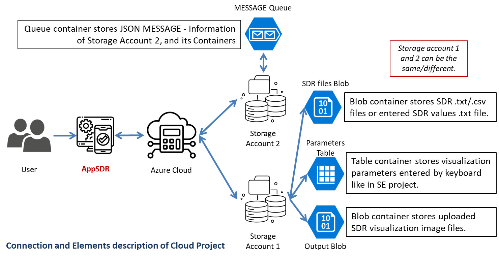

# ML22-23-8 Implement the SDR representation in the MAUI application - Azure Cloud Implementation

This project requires the implementation of the SE Project topic "ML22-23-8 Implement the SDR representation in the MAUI application" onto the cloud computing platform. Microsoft Azure is the core platform for constructing and building the web App SDR application. Azure provides the data storage, letting the app store inputs and outputs in a container or queue, and show how the app could utilize the Azure's services.

## Table of contents
1. [Introduction](#introduction)
2. [Important Project Links](#important-project-links)
    * [SE Project links](#se-project-links)
    * [Cloud Project links](#cloud-project-links)
3. [Goal of Cloud Project](#goal-of-cloud-project)
    * [Connections and Elements](#connections-and-elements)
    * [Manual method](#manual-method)
    * [Automatic method](#automatic-method)
4. [Overview of the cloud architecture](#overview-of-the-cloud-architecture)
5. [Implementation of new properties in AppSDR](#implementation-of-new-properties-in-appsdr)
    * [UI implementation](#ui-implementation)
    * [Logic implementation](#logic-implementation)
6. [Experiment and evaluation](#experiment-and-evaluation)
    * [Experiment description](#experiment-description)
    * [Container Registry](#container-registry)
    * [Evaluation](#evaluation)
7. [Conclusion](#conclusion)

## Introduction
The first version (v1.0) of AppSDR is the .NET MAUI app visualizing the Sparse Distribution Representations (SDR) with the user's SDR values and drawing specifications. The map's primary functions are taking the parameters for graph visualization, and the SDR values with local files or manually set. This version only lets users work with one file per time, and cannot share with others directly. The efficiency is not high when AppSDR visualizes a significant model. Therefore, this project proposes to upgrade AppSDR to the second version (v2.0), having the followings:

1. Remaining all the properties in AppSDR v1.0: 
    * The input table takes eight parameters: Graph Name, Max Cycles, Highlight Touch, X-Axis Title, Y-Axis Title, Min Range, and Max Range, for output graphics.
    * The input button chooses the SDR values, taken from an SDR file (.txt, .csv) or the user's keyboard.
    * The page visualizes the values based on the SdrDrawerLib library, table parameters, and SDR values.
    * Images can be saved to the local machine.

2. Implementing new methods for Cloud properties:
    * Manual method: the user connects to a defined *Storage Account 1*, enters and uploads to Table Container the mentioned eight parameters, selects and uploads multiple SDR files (.txt, .csv) or a user' SDR values from the keyboard to Blob Container, generates and uploads the output images to Blob Container.

    * Automatic method: the user connects to a defined *Storage Account 2*, and uploads a MESSAGE to Queue Container. The MESSAGE has all the information of participating containers in *Storage Account 2*. When the user listens to MESSAGE, AppSDR proceeds like in manual methods, without inputting or uploading anything. 

For Cloud implementation on the AppSDR, the followings are created.

* Modify the original pages with new variables and properties to navigate to a new page.
* Add a new *UploadPage* to handle the cloud properties, with new UI elements to specify the pointed Azure data objects (Storage Account, Blob, Queue, and Table Storage).
* Add two new classes to handle the *Message operation* functions, working as the automatic generation when users want outputs with the Azure platform.

The new version of AppSDR can be operated manually and automatically, depending on users' purpose. This project mainly works on Azure Storage Account. Dockers and Azure Services are not included in this implementation.

## Important Project Links
### SE Project links
1. SE Project Documentation: [PDF](../../MySEProject/Documentation/ML22-23-8-Implement%20the%20SDR%20representation%20in%20the%20MAUI%20application_MAUI_App_SDR-Paper.pdf)<br/>
2. README files: [Description](../../MySEProject/Documentation/Readme.md), [User Manual](../../MySEProject/Documentation/UserManual.md)
3. Implemented classes: [MainViewModel()](../../MySEProject/AppSDR/ViewModel/MainViewModel.cs), [Page1ViewModel()](../../MySEProject/AppSDR/ViewModel/Page1ViewModel.cs), [MainPage()](../../MySEProject/AppSDR/MainPage.xaml.cs), [TextEditorPage()](../../MySEProject/AppSDR/TextEditorPage.xaml.cs), [Page1()](../../MySEProject/AppSDR/Page1.xaml.cs)<br/>
4. SDR drawing library: [SdrDrawerable()](../../MySEProject/AppSDR/SdrDrawerLib/SdrDrawable.cs)<br/>
5. Sample SDR inputs: [Folder](../../MySEProject/Documentation/TestSamples/)

### Cloud Project links
1. Cloud Project Documentation: [Experiment Specification](./Experiment%20Specification%20-%20Anh%20Tong%20Ngoc%20Minh%20-%20Son%20Pham%20Tien.md)
2. Other README file: [User Manual](User%20Manual.md)
3. UI implemenation of Cloud Configuration Page: [UploadPage.cs](../AppSDR/UploadPage.xaml)
4. Logic implementation class of Cloud Configuration Page: [UploadPage()](../AppSDR/UploadPage.xaml.cs), [UploadViewModel()](../AppSDR/ViewModel/UploadViewModel.cs)
5. Message handle class: [ExperimentRequestMessage()](../AppSDR/ExperimentRequestMessage.cs), [QueueMessageListener()](../AppSDR/QueueMessageListener.cs)
6. Project solution: [MyCloudProject.sln](../MyCloudProject.sln)

## Goal of Cloud Project
Microsoft Azure is an open and flexible cloud-computing platform. The scope of this project is to apply Azure Cloud to the Software Project of .NET MAUI (AppSDR), using Azure storage containers for storing inputs and outputs of the app. In general, the project involves:

* Modifying the .NET MAUI app v1.0 to access the Azure Storage Account. The main idea is to create the *BlobStorageService* class, holding the input storage account information, and which type of storage is used. 
* Creating a new page with new functions to interact with the Azure storage account, including uploading and downloading files. Users on this page specify the storage information calling the *BlobStorageService* to access the provided storage account.
* Adding a button for *Listening Mode* which waits for messages indicating that CSV files are ready for processing in a specified container. Users can manually upload messages, and when ready, a message can be sent programmatically. The app initiates file processing on-demand without waiting for the message, ensuring flexibility in operation.

AppSDR is operated locally, not dockerized, to receive the user's input interaction. The app accesses the specific cloud storage and saves the user's input. The SDR representation is saved on the storage and can be downloaded to the local machine.

## Overview of the Cloud Architecture
The Cloud project combines the AppSDR v2.0 functionalities and Azure Cloud storage ability; therefore, this section provides the Cloud Architecture to describe the combination and how the AppSDR works with the Cloud. There are three diagrams to be described: the connection, manual operation, and automatic operation methods.

### Connections and Elements 

The Azure Cloud is the new implementation in this project, so the connections among the Cloud elements must be specified. The next figure only shows the connection of AppSDR with Azure Cloud Storage Accounts and Containers, not the operation. 

<div style="background-color: #ffffff; text-align:center">
  </img>
</div><br>

There are three main participants in the Cloud Project: users, AppSDR v2.0, and Azure Cloud. AppSDR acts as the bridge between users and Cloud Storage. Depending on the users' inputs and commands, AppSDR accesses the Azure Cloud, and uploads or retrieves data from the Cloud Containers. The two-way arrows show that data is possibly transmitted back and forth between two elements. The diagram shows two Storage Accounts in the project, but users can consider *Storage Account 1* as 2. They can upload to and listen to MESSAGE in the *Storage Account 1* Queue.

* *Storage Account 1* attends to both generation methods, as its containers hold the input values and outputs of the SDR visualization process. 
    - The *SDR files Blob* contains .txt/.csv files having the SDR values. 
    - The *Parameters Table* has the defined entities. Each entity has 11 properties. The first three are system properties specifying a partition key, a row key, and a timestamp. The rest are the eight parameters the user defines for the SDR visualization function: Graph Name, Max Cycles, Highlight Touch, X-Axis Title, Y-Axis Title, Min Range, and Max Range. 
    - The *Output Blob* stores the output images.

* *Storage Account 2* is used in the automatic method, having one Queue Container.  The *MESSAGE Queue* stores the JSON message text - Connection String to *Storage Account 1*, the two Blobs, and the Table names. The MESSAGE is uploaded by the users to the Queue.

### Manual method
The diagram illustrates the architecture of AppSDR v2.0 in the manual method. The app interacts with Storage Account 1 to upload and retrieve parameters, SDR files, and output images, for generating and updating visualizations.

<div style="background-color: #ffffff; text-align:center">
  </img>
</div><br>

* User Input and Initial Connection: Users begin by providing information to the AppSDR, which includes SDR files or entered SDR values along with eight defined parameters. The app then connects to *Storage Account 1* to facilitate the upcoming data exchanges.

* Uploading Parameters and SDR Files: The app uploads the eight defined parameters to the Parameters Table Storage and the chosen SDR files or entered SDR values to the SDR Files Blob Storage in the cloud.

* Triggering and Accessing Visualizations: Once the necessary data is uploaded, the app triggers the SDR visualization process. It then accesses the required storage resources, including both the Parameters Table Storage and SDR Files Blob Storage, to retrieve the uploaded parameters and SDR files.

* Data Retrieval and Interface Update: The app retrieves the uploaded parameters and SDR files, using this data to update the AppSDR interface, ensuring the necessary information is displayed to the user.

* Generating and Uploading Visual Outputs: The app generates SDR visualizations based on the retrieved data. These visual outputs are displayed on the user interface and are subsequently uploaded to the Output Blob Storage within *Storage Account 1* for long-term storage.

### Automatic method
This diagram illustrates an automated workflow where AppSDR interacts with two Azure Storage Accounts to process and generate SDR visualizations. The flow involves uploading a message to a queue, triggering automated processes, and accessing storage accounts to retrieve data and upload output images.

<div style="background-color: #ffffff; text-align:center">
  </img>
</div><br>

* User Input and Initial Connection: Users provide necessary information to the AppSDR, including a message that is uploaded to a MESSAGE Queue in *Storage Account 2* (steps 1-3).

* Triggering Automation: The uploaded message triggers an automatic process within the AppSDR, which retrieves the message from the queue and updates the app with this information (steps 4-7).

* Data Retrieval from Cloud Storage: The AppSDR then accesses *Storage Account 1* to retrieve the eight parameters from Parameters Table Storage and the SDR files from SDR Files Blob Storage (steps 8-10).

* Interface Update and Visualization Generation: The retrieved data is used to update the AppSDR interface, after which SDR visualizations are automatically generated and displayed on the user interface (steps 11-12).

* Final Output Storage: The generated visual outputs are uploaded as images to the Output Blob Storage within *Storage Account 1* for final storage and accessibility (steps 13-14).

## Implementation of new properties in AppSDR
The primary AppSDR's architecture from the SE Project remains, adding the Cloud-configuration *Upload Page*, and additional functions in existing pages to handle Azure Cloud components. The visualization for the new application described in the figure below has black and blue components representing the original AppSDR and red components for the Cloud Project implementation.

<div style="background-color: #ffffff; text-align:center">
  </img>
</div><br>

The new properties are implemented with the following specifications.

* Besides the specified inputs in the SE project to *Main Page*, a new handling place is created to take the *Message Configuration* used for automatic SDR visualization generation. This input is optional, so when users want to proceed with the operation manually, they can ignore this input area.
* A New *Upload Page* is created to take *Cloud Configuration* for Cloud accession. *Upload Page* is navigable from *Main Page, Text Editor Page*, and points to *Page 1*. This page calls additional classes to proceed with the *Message* from *Main Page*.

The *xaml* code for the addition is based on the original AppSDR, reviewed on the previous [Readme](../../MySEProject/Documentation/Readme.md). Details on UI and Logic implementation new configuration and steps are explained in the next subsections. 

### UI implementation
AppSDR remains the primary UI foundation, adding a new *Upload Page* defined as the following diagrams. For the initial pages, new arrangements are applied with new old and additional components.

<div style="background-color: #ffffff; text-align:center">
  </img>
</div><br>

The content and navigation of the UI elements of *Page 1* remains as in SE Project. While the existing *Main Page* and * Text Editor Page* have added components, following the configurations below.
* In *Main Page*, SDR picture and parameters inputs table stay the same. *Labels* are added to specify the button functions, corresponding to the same-line buttons. 
* A block of Message Configuration is added for users to provide *Storage Account* information and *MESSAGE*, accessing and uploading to the *Queue Container*. A new button is added to handle this block.
* Instead of *Entry*, AppSDR uses *Editor to carry this block inputs, as the content might be too long just for the *Entry* visualization.
* In *Text Editor Page*, one button is added, carrying the navigation to *Upload Page*.

The new *Upload page* contains two parts: the left one for Cloud configuration and the right parts for the actual operating functions, described in the next points: 
* Configure Storage: This section likely provides controls (buttons, text fields) to configure storage settings, such as connection strings or storage account details for Azure.
* Configure Blob & Table: Similar to storage configuration, but specifically for configuring Azure Blob Storage and Table Storage. This might involve selecting or creating containers and tables.
* Status: Displays the current status of operations, such as storage configuration, upload status, or connection status.
* Manual Generation: Controls to manually trigger the generation of messages or data that will be uploaded or processed.
* Message Generation: Controls related to automating or managing the generation of messages that the system will process or upload.
* Message Status: A display area showing the status of the messages being handled by the system, possibly indicating success, failure, or progress.

*Upload Page* has two panels for two applications, so the *Layout* must be combined. The left panel components fit in the preview size of the AppSDR, so the *StackLayout* is used. For the right panel, the components may exist in the area, so the *ScrollView* is used, with the *StackLayout* inside. Both of the panels are on the *Grid* to restrain the UI elements and are better to modify.

```xaml
    <Grid RowDefinitions="Auto,*" ColumnDefinitions="250,*,*,*,*,*">
        <!-- Left Panel with Storage Configuration Options -->
        <StackLayout Grid.Row="0" Grid.Column="0" Grid.RowSpan="2"
                     BackgroundColor="{StaticResource LeftPanelBackgroundColor}"
                     Padding="10" Spacing="10">     
        </StackLayout>

        <!-- Right Panel with SDR Visualization -->
        <ScrollView Grid.Row="0" Grid.Column="1" Grid.ColumnSpan="5"
                    BackgroundColor="{StaticResource RightPanelBackgroundColor}"
                    Padding="10">
            <StackLayout Spacing="20">
                <Label Text="GENERATE SDR VISUALIZATION" 
                       FontAttributes="Bold" 
                       TextColor="{StaticResource PrimaryTextColor}" />
            </StackLayout>
        </ScrollView>
    </Grid>
```
### Logic implementation
The logic implementation remains unchanged for *MainPage(), Page1ViewModel()*. Other classes have configurations to handle new variables and functions on Cloud elements, especially the *UploadPage(), UploadViewModel(), QueueMessageListener(), ExperimentRequestMessage(), and TableEntityConfiguration()*. As the AppSDR accesses to Blob, Queue and Table containers, the mentioned packages must be included for the app to operate.

```csharp
using Azure.Data.Tables;
using Azure.Storage.Blobs;
using Azure.Storage.Queues;
```

First, the *MainViewModel()* is described as new functions and binding context is added. The binding context stores the information of the Queue Container and the MESSAGE used for *Message generation*. Other function is summarized as:
* *AddText()*: Prepare and navigate to a *Text Editor Page* with the necessary configuration and user-provided values.
* *NavigateToUploadPage()*: Navigate to the *Upload Page* with parameters, and handles any navigation errors.
* *UploadMessage()*: Handles sending a message to an Azure queue and updates message configuration, with error handling.
* *SendMessageToQueue()*: Manages the creation of the queue if needed, sends a message, and provides feedback on success or failure.

In *TextEditorPage()*, a new function is added to transform the entered SDR values into a .txt file, and save it to Desktop. Then, AppSDR navigates to *Upload Page* with parameters taken from *Main Page* and the text file. The main property is to save values into a file, as in the code snippet below.

```charp
                // Get the path to the user's desktop directory
                string desktopPath = Environment.GetFolderPath(Environment.SpecialFolder.Desktop);

                // Define the file name and full path
                string fileName = "SavedSDR.txt";
                string filePath = Path.Combine(desktopPath, fileName);

                // Write the content to the file
                File.WriteAllText(filePath, fileContent);
```

*UploadPage()* is defined similar to *MainPage()*. Details can be checked in SE project [Readme](../../MySEProject/Documentation/Readme.md). Relations and functions are specified in *UploadViewModel*. The important variables (or inputs) *Upload Page* must analysized are:
```csharp
public INavigation Navigation { get; set; }
public string AssignedTextFilePath { get; set; }
public string[] MessageConfig { get; set; }
public List<string> SelectedFiles { get; set; }
public string[] EntryCellValues { get; set; }
public string ConnectionString { get; set; }
public string StorageAccount { get; set; }
public bool IsConnected { get; set; }
public string UploadBlobStorageName { get; set; }
public string DownloadBlobStorageName { get; set; }
public string TableStorageName { get; set; }
public string StatusMessage { get; set; }
public string ListenMessage { get; set; }
```

* *SelectAndUploadFileAsync()* handles file selection and upload to Azure Blob Storage, only executable if CanExecuteCommands returns true.
* *DownloadFilesAsync()* manages the download of files from Azure Blob Storage, enabled only when command configurations conditions are met.
* *OnConnectAsync()* initiates the connection to Azure services and updates the connection status.
* *UploadParameters()* uploads experiment parameters to Azure Table Storage, executable if connection parameters are valid and *EntryCellValues* are not null.
* *GenerateOutput()* processes blobs from Azure Blob Storage and navigates to a new page for visualization, only executable if commands can be executed based on the connection status.
* *StartListening()* starts listening for messages from an Azure Queue, enabled if MessageConfig is properly configured.
* *StopListening()* stops the message listening process initiated by StartListeningCommand.

Next, *Page1()* is discused. The foundational functions are kept, while a new task is applied to handle multiple visualizations and connect to Azure Cloud Storage.
* The *SaveScreenshotToBlobStorage* function captures the current screen, names the file with a timestamp (optionally including an identifier), and uploads it to Azure Blob Storage. After the upload, it informs the user of success with an alert. If the screenshot capture fails, an error message is shown instead.
```csharp
    public async Task SaveScreenshotToBlobStorage()
    {
        // Capture the screenshot
        IScreenshotResult screenshotResult = await DrawableView.CaptureAsync();

        if (screenshotResult != null)
        {
            using (var stream = await screenshotResult.OpenReadAsync())
            {
                // Generate a unique file name using a timestamp
                string timestamp = DateTime.UtcNow.ToString("yyyyMMddHHmmssfff");
                string blobName;

                if (_entryCellValues[7] != null)
                {
                    blobName = $"{_entryCellValues[7]}_{timestamp}.png";
                }
                else
                {
                    blobName = $"{timestamp}.png";
                }

                BlobServiceClient blobServiceClient = new BlobServiceClient(_connectionString);
                BlobContainerClient containerClient = blobServiceClient.GetBlobContainerClient(_downloadBlobStorage);
                BlobClient blobClient = containerClient.GetBlobClient(blobName);

                await blobClient.UploadAsync(stream, new BlobHttpHeaders { ContentType = "image/png" });
                // Optional delay before the next operation
                await DisplayAlert("Success", "Screenshot has been saved successfully.", "OK");
            }
        }
        else
        {
            // Display a message if no screenshot was captured
            await DisplayAlert("Error", "Failed to capture screenshot.", "OK");
        }
    }
```

The *Message generation* uses *QueueMessageListener.cs* with the corresponding class to access and process the MESSAGE. The class includes:
* *ListenToMessagesAsync()* function: Continuously listens to an Azure Queue for messages, deserializes them into ExperimentRequestMessage objects, and processes each one. It handles errors and displays alerts for issues.
* *ProcessExperimentRequestAsync()* function: Download and process blobs from Azure Blob Storage based on an experiment request. It reads and parses blob content then navigates to *Page 1* for data visualization.
* *DownloadBlobToFileAsync()* function: Download a blob to a local file and save it. Alerts the user if any errors occur during the download.
* *ProcessDownloadedFileAsync()* function: Read and parse the downloaded file, retrieves additional configuration from Azure Table Storage, and navigates to *Page 1* for further processing. The task uses the above downloaded files and goes through all files.
* *DownloadEntity()* function: Retrieve all entity configurations from Azure Table Storage and return them as an array of strings.
* *ParseFileContent()* function: Convert file content into a 2D integer array, filtering out empty or irrelevant rows, to be used for further processing.
* *IsBase64String()* function: Checks if a string is valid Base64, useful for decoding messages.
* *SanitizeFileName()* function: Replaces invalid characters in file names with underscores to ensure they are safe for saving locally.

The *ExperimentRequestMessage()* handles the MESSAGE retrieved from the Queue Container. The following four variables must be in MESSAGE to make *QueueMessageListener()* valid.

```csharp
namespace AppSDR
{
    public class ExperimentRequestMessage
    {
        public string StorageConnectionString { get; set; }
        public string UploadBlobStorageName { get; set; }
        public string DownloadBlobStorageName {  get; set; }
        public string TableStorageName { get; set; }
    }
}
```
The *TableEntityConfiguration()* handles the entity corresponding to each defined parameters. This class is called when user want to upload or download the eight parameters to or from the Table Container.

```csharp
using Azure;
using Azure.Data.Tables;

namespace AppSDR
{
    // Class handles table entities when working with Table Storage
    public class TableEntityConfiguration : ITableEntity
    {
        public string PartitionKey { get; set; }
        public string RowKey { get; set; }
        public string GraphName { get; set; }
        public string MaxCycles { get; set; }
        public string HighlightTouch { get; set; }
        public string XaxisTitle { get; set; }
        public string YaxisTitle { get; set; }
        public string MinRange { get; set; }
        public string MaxRange { get; set; }
        public string SavedName { get; set; }
        public DateTimeOffset? Timestamp { get; set; }
        public ETag ETag { get; set; }
    }
}
```

## Experiment and evaluation
AppSDR v2.0 is tested with its Cloud properties in this section. As mentioned, aside from running one visualization with the local machine (or without using Cloud Storage), the app has two methods for SDR visualization using the Storage Account. The manual method has three possible cases, While for the automatic one, a case is tested. 

1. Case 1: requires a high level of user participation, as the user has to configure everything and proceed with the generation step by step.
    * Inputs: Connection String and Storage Name of *Storage Account 1*, two Blobs, one Table container name,  eight parameters, and multiple existing SDR files (.txt, .csv).
2. Case 2: is similar to case 1, except for the existing SDR files. Instead of choosing files, users enter SDR values through the keyboard. 
    * Inputs: Connection String and Storage Name of *Storage Account 1*, two Blobs, one Table container name,  eight parameters, and entered SDR values.
3. Case 3: is suggested if all the SDR files Blob, and Parameters Table are not empty. The user has to configure only the information for Cloud accession. The process is made step by step.
    * Inputs: Connection String and Storage Name of *Storage Account 1*, two Blobs, one Table container name.
4. Case 4: is similar to case 3 in conditions, but different in the inputs and the process. Users upload a MESSAGE to a Queue Container. When they start listening to the MESSAGE in Queue, the process runs and provides the outputs, without any extra actions.
    * Inputs: Connection String of *Storage Account 2* and Queue Container name, MESSAGE content, and listening mode.

Other possibilities can be made by combining manual and automatic methods. For example: MESSAGE is used even when SDR files Blob and Parameters Table are empty. Users upload the MESSAGE but snooze the listening mode. Then they connect to *Storage Account 1* and configure the Container content. Now the containers are not empty, start the listening mode. This case is not described in this document.

**Outputs**:  this specification evaluates the outputs by describing their components, and compares the output forms of v2.0 to v1.0. We can view the output representations of four test cases in the "How to run" section of [User Manual](User%20Manual.md).

The test inputs used for the experiments can be found on [Test Samples](./TestSamples/). This folder has two .txt files and one .csv file. The [samplerandom.txt](./TestSamples/samplerandom.txt) and [sampleSheet.csv](./TestSamples/sampleSheet.csv) have sufficient SDR columns, and the visualizations fit the default AppSDR screen on Window machine. While [sampleZero.txt](./TestSamples/sampleZero.txt) has more than 1000 columns, and the visualization exists the default screen size.

### Experiment description

This section describes the Input components, and Experiment running conditions in detail. For the operation step of all cases, please check [User Manual](User%20Manual.md).

#### Configured inputs
* The Storage Accounts used for testing in this project are defined with the following information. If users want to use their own Storage Account, the following keys should also be retrieved from their acccount.

```
Storage Account 1
- Connection String: "DefaultEndpointsProtocol=https;AccountName=mauiprojectcloud;AccountKey=gDYct5X+8L0wUco6yIYFSvfdh/1UbwYmAAashjpETQ1czbYjS/1dtdgdhW0pjOlQoqmWqbAbXslb+AStiMasTw==;BlobEndpoint=https://mauiprojectcloud.blob.core.windows.net/;QueueEndpoint=https://mauiprojectcloud.queue.core.windows.net/;TableEndpoint=https://mauiprojectcloud.table.core.windows.net/;FileEndpoint=https://mauiprojectcloud.file.core.windows.net/;"
- Storage Account Name: "mauiprojectcloud-1"
- Upload Blob Storage Name": "sdrfiles", storing SDR files containing SDR values
- Download Blob Storage Name": "saveoutput", storing Outputs of the operation
- Table Storage Name: "parameters", storing the entities defining the SDR graphs (or outputs)

Storage Account 2
- Connection String: "DefaultEndpointsProtocol=https;AccountName=mauiprojectcloud;AccountKey=gDYct5X+8L0wUco6yIYFSvfdh/1UbwYmAAashjpETQ1czbYjS/1dtdgdhW0pjOlQoqmWqbAbXslb+AStiMasTw==;BlobEndpoint=https://mauiprojectcloud.blob.core.windows.net/;QueueEndpoint=https://mauiprojectcloud.queue.core.windows.net/;TableEndpoint=https://mauiprojectcloud.table.core.windows.net/;FileEndpoint=https://mauiprojectcloud.file.core.windows.net/;"
- Queue Storage Name: "trigger", storing the MESSAGE
```

* The MESSAGE is in json format, can be uploaded to Queue
```json
{
"StorageConnectionString":"DefaultEndpointsProtocol=https;AccountName=mauiprojectcloud;AccountKey=gDYct5X+8L0wUco6yIYFSvfdh/1UbwYmAAashjpETQ1czbYjS/1dtdgdhW0pjOlQoqmWqbAbXslb+AStiMasTw==;BlobEndpoint=https://mauiprojectcloud.blob.core.windows.net/;QueueEndpoint=https://mauiprojectcloud.queue.core.windows.net/;TableEndpoint=https://mauiprojectcloud.table.core.windows.net/;FileEndpoint=https://mauiprojectcloud.file.core.windows.net/;",
"UploadBlobStorageName": "sdrfiles",
"DownloadBlobStorageName": "saveoutput",
"TableStorageName": "parameters"
}
```
* The eight parameters can be defined as follows.

```
Parameters
- Graph name: Sample graph
- Max cycles: 1500
- Highlight touch: 3
- X axis title: SDR columns
- Y axis title: SDR values
- Min range of cell: 0
- Max range of cell: 10000
- Saved figure name: SavedSDR
```

Next is a detailed description of the input components and cloud storage conditions for the four test cases.

#### Case 1

* The inputs include a Connection String and Storage Name for *Storage Account 1*, along with the names of two Blobs and one Table. Users also provide eight parameters and multiple existing SDR files in .txt or .csv format.
* This case is processable when *Storage Account 1* exists, but the SDR files Blob, Parameters Table, and Output Blob containers within it are empty and do not contain any data.

#### Case 2

* Users provide a Connection String and Storage Same for *Storage Account 1*, as well as the names of two Blob containers and one Table container. Additionally, they input eight parameters and manually enter SDR values, which are saved into a .txt file.
* The condition for this case is similar to Case 1, where *Storage Account 1* exists, but the SDR files Blob, Parameters Table, and Output Blob containers are empty.

#### Case 3

* The inputs include a Connection String and Storage Name for Storage Account 1, along with the names of two Blob containers and one Table container.
* *Storage Account 1* must exists, and its SDR files Blob, Parameters Table, and Output Blob containers already contain some data.

#### Case 4

* The inputs for this case involve a Connection String for *Storage Account 2* and the name of a Queue.
* The condition is that both *Storage Account 1* and *Storage Account 2* exist. Additionally, Storage Account 1* already has data in its *SDR files Blob, Parameters Table*.

### Container Registry 
We can tell from the experiments that AppSDR only adopts Azure Storage into the application. The storage can be categorized into: Input and Output containers. 

* For test cases 1, 2, and 3, there are two Input Containers: one Blob and one Table. Test case 4 has four Input Containers: a Blob, Table, and Queue.
* The Output Container is the same for all cases: a Blob. A detailed description of all containers is provided below.

**Input Blob Container (sdrfiles)**

* This container is part of *Storage Account 1*, storing the input files required for running the experiments, .txt, and .csv files for drawing SDR representations.
* The container name is specified in MESSAGE, and retrieved when needed.

  <div style="background-color: #ffffff; text-align:center">
  </img>
  </div><br>

**Parameters Table (parameters)** 

* This container is part of *Storage Account 1*, storing the input parameters as a table entity, having 11 properties. 
* The last eight properties are the parameters: Graph Name, Max Cycles, Highlight Touch, X-Axis Title, Y-Axis Title, Min Range, and Max Range.
* The container name is specified in MESSAGE, and retrieved when needed.

  <div style="background-color: #ffffff; text-align:center">
  </img>
  </div><br>

**MESSAGE Queue (trigger)**

* This container is part of *Storage Account 2*, storing the MESSAGE in JSON format. 
* The MESSAGE has information on *Storage Account 1*: Connection String, Upload Blob Storage Name, Download Blob Storage Name, and Table Storage Name.
* When MESSAGE is listened to, its content is retrieved to take the information to *Storage Account 1*. 

  <div style="text-align:center">
    </img>
  </div><br>

**Result Container (saveoutput)**

* This container is part of *Storage Account 1*, storing the output files in image format. 
* The container name is specified in MESSAGE, and retrieved when needed.
    
  <div style="background-color: #ffffff; text-align:center">
  </img>
  </div><br>

### Evaluation
After testing the experiments, and the [Readme](../../MySEProject/Documentation/Readme.md) from the SE project, the AppSDR v1.0 and 2.0 possible operations can be summarized in the table below.

|Version|Input type|Inputs|Outputs|
|-------|----------|------|-------|
|v1.0|User's keyboard, a file (.txt, .csv)|Eight parameters, SDR file|UI visualization, saved figure on Desktop|
||User's keyboard|Eight parameters|UI visualization, saved figure on Desktop|
|v2.0|User's keyboard, multiple files (.txt, .csv)|*Storage Account 1* containers information, multiple existing SDR files|UI visualizations, saved figures on *Storage Account 1*|
||User's keyboard|*Storage Account 1* containers information, entered SDR values|UI visualization, saved figure on *Storage Account 1*|
||User's keyboard|*Storage Account 1* containers information|UI visualizations, saved figures on *Storage Account 1*|
||User's keyboard|*Storage Account 2* Queue information, MESSAGE containing *Storage Account 1* containers information|UI visualizations, saved figures on *Storage Account 1*|

**Version 1.0**: is the foundation for the AppSDR's functionality, focusing on local input and output handling.

* Input: Users could provide inputs via keyboard or by uploading a file (.txt, .csv) containing eight parameters or an SDR file.
* Output: The application generated UI visualizations and saved the resulting figures directly to the Desktop.

**Version 2.0**:  significantly expanded the application's functionality by integrating Azure Storage, enhancing both input flexibility and output destinations, while introducing automated processing capabilities.

* Enhanced Input Capabilities: Users can now interact with the application through the keyboard and can also manage multiple files. This version allows interaction with Azure Storage Accounts, enabling more complex workflows involving cloud storage.
* Diverse Output Destinations: Outputs are not just saved on the Desktop but are now stored directly in specified Azure Storage Accounts, enhancing accessibility and scalability.
* Interaction with multiple SDR files stored in *Storage Account 1* for generating UI visualizations and saving the figures back to *Storage Account 1*.
Users can manually input SDR values into the UI, which are then visualized and saved in *Storage Account 1*.
* The application supports scenarios where users provide only container information, and the application handles the retrieval and processing of data to generate visualizations stored in the cloud.
* Listening mode: the integration with *Storage Account 2* enables the use of Queue MESSAGE containing references to data in *Storage Account 1*, allowing for automated processing and storage of visualization results in *Storage Account 1*.
* The App visualization for cases of multiple files does not well appear. It stacks onto one another. For the case of one output, the appearance is similar to the primary AppSDR.

The representation for one visualization.

<div style="text-align:center">
  </img>
</div><br>

The representation for three visualizations.

<div style="text-align:center">
  </img>
</div><br>


## Conclusion
In summary, the experiments demonstrate the enhanced capabilities of AppSDR with the integration of Cloud Storage, enabling the storage of both outputs and operating values in a more efficient and scalable way. The introduced *Listening Mode* offers an improvement by allowing users to simply visualize SDR values, streamlining the process, and making the app more user-friendly for handling large-scale operations. However, the visualization feature for multiple files still requires refinement. Despite this limitation, the app remains effective for single-output cases, maintaining the reliability and functionality of the original AppSDR.