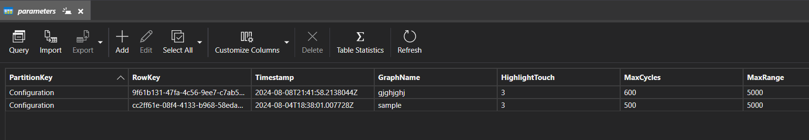

# ML22-23-8 Implement the SDR representation in the MAUI application - Azure Cloud Implementation

This project requires the implementation of the SE Project topic "ML22-23-8 Implement the SDR representation in the MAUI application" onto the cloud computing platform. Microsoft Azure is the core platform for constructing and building the web App SDR application. Azure provides the data storage, letting the app store inputs and outputs in a container or queue, and show how the app could utilize the Azure's services.

## Table of contents
1. [Introduction](#introduction)
2. [Important Project Links](#important-project-links)
    * [SE Project links](#se-project-links)
    * [Cloud Project links](#cloud-project-links)
3. [Goal of Cloud Project](#goal-of-cloud-project)
4. [Implementation of new properties in AppSDR](#implementation-of-new-properties-in-appsdr)
    * [UI implementation](#ui-implementation)
    * [Logic implementation](#logic-implementation)
5. [Overview of the cloud architecture](#overview-of-the-cloud-architecture)
6. [Experiment and evaluation](#experiment-and-evaluation)
    * [How to run experiment](#how-to-run-experiment)
    * [Evaluation](#evaluation)
7. [References](#references)

## Introduction
AppSDR is the .NET MAUI app visualizing the Sparse Distribution Representations (SDR) with the user's SDR values and drawing specifications. The map's primary functions are taking the parameters for graph visualization, and the SDR values with local files or manually set. For Cloud implementation on the AppSDR, the following are created.

* Modify the original pages with new variables and properties to navigate to a new page.
* Add a new *UploadPage* to handle the cloud properties, with new UI elements to specify the pointed Azure data objects (Storage Account, Blob, Queue, and Table Storage).
* Add two new classes to handle the *Message operation* functions, working as the automatic generation when users want outputs with the Azure platform.

The new version of AppSDR can be operated manually and automatically, depending on users' purpose. This project mainly works on Azure Storage Account. Dockers and Azure Services are not included in this implementation.

## Important Project Links
### SE Project links
1. SE Project Documentation: [PDF](../../MySEProject/Documentation/ML22-23-8-Implement%20the%20SDR%20representation%20in%20the%20MAUI%20application_MAUI_App_SDR-Paper.pdf) 
2. README files: [Description](../../MySEProject/Documentation/Readme.md), [User Manual](../../MySEProject/Documentation/UserManual.md)
3. Implemented classes: [MainViewModel()](../../MySEProject/AppSDR/ViewModel/MainViewModel.cs), [Page1ViewModel()](../../MySEProject/AppSDR/ViewModel/Page1ViewModel.cs), [MainPage()](../../MySEProject/AppSDR/MainPage.xaml.cs), [TextEditorPage()](../../MySEProject/AppSDR/TextEditorPage.xaml.cs), [Page1()](../../MySEProject/AppSDR/Page1.xaml.cs) 
4. SDR drawing library: [SdrDrawerable()](../../MySEProject/AppSDR/SdrDrawerLib/SdrDrawable.cs) 
5. Sample SDR inputs: [Folder](../../MySEProject/Documentation/TestSamples/)

### Cloud Project links
1. Cloud Project Documentation: [Experiment Specification](./Experiment%20Specification%20-%20Anh%20Tong%20Ngoc%20Minh%20-%20Son%20Pham%20Tien.md)
2. Other README file: [User Manual](User%20Manual.md)
3. UI implemenation of Cloud Configuration Page: [UploadPage.cs](../AppSDR/UploadPage.xaml)
4. Logic implementation class of Cloud Configuration Page: [UploadPage()](../AppSDR/UploadPage.xaml.cs), [UploadViewModel()](../AppSDR/ViewModel/UploadViewModel.cs)
5. Message handle class: [ExperimentRequestMessage()](../AppSDR/ExperimentRequestMessage.cs), [QueueMessageListener()](../AppSDR/QueueMessageListener.cs)
6. Project solution: [MyCloudProject.sln](../MyCloudProject.sln)

## Goal of Cloud Project
Microsoft Azure is an open and flexible cloud-computing platform. The scope of this project is to apply Azure Cloud to the Software Project of .NET MAUI (AppSDR), using Azure storage containers for storing inputs and outputs of the app. In general, the project involves:

* Modifying the current .NET MAUI app to access the Azure storage account. The main idea is to create the *BlobStorageService* class, holding the input storage account information, and which type of storage is used. 
* Creating a new page with new functions to interact with the Azure storage account, including uploading and downloading files. Users on this page specify the storage information calling the *BlobStorageService* to access the provided storage account.
* Adding a button for *Listening Mode* which waits for messages indicating that CSV files are ready for processing in a specified container. Users can manually upload messages, and when ready, a message can be sent programmatically. The app initiates file processing on-demand without waiting for the message, ensuring flexibility in operation.

AppSDR is operated locally, not dockerized, to receive the user's input interaction. The app accesses the specific cloud storage and saves the user's input. The SDR representation is saved on the storage and can be downloaded to the local machine.

## Implementation of new properties in AppSDR
The primary AppSDR's architecture from the SE Project remains, adding the Cloud-configuration *Upload Page*, and additional functions in existing pages to handle Azure Cloud components. The visualization for the new application described in the figure below has black and blue components representing the original AppSDR and red components for the Cloud Project implementation.

  </img>

 

The new properties are implemented with the following specifications.
* Besides the specified inputs in the SE project to *Main Page*, a new handling place is created to take the *Message Configuration* used for automatic SDR visualization generation. This input is optional, so when users want to proceed with the operation manually, they can ignore this input area.
* A New *Upload Page* is created to take *Cloud Configuration* for Cloud accession. *Upload Page* is navigable from *Main Page, Text Editor Page*, and points to *Page 1*. This page calls additional classes to proceed with the *Message* from *Main Page*.

### UI implementation

### Logic implementation

## Overview of the Cloud Architecture

## Experiment and evaluation

### How to run experiment

This section describes how to run the Cloud Experiment based on the input/output mentioned in the Experiment Description section. 
We have 3 experiments in this Maui Cloud Project:

**1. Upload parameters for drawing SDR Representations**
First, user are enable to upload parameters for drawing SDR Representation by input all of these parameter in the following image: 

  </img>

 

  
When finished, the Button “Cloud Configuration” allow users to specify the Azure Storage to upload parameters and choose .csv files to upload to Blob Storage.

Specify detailed Azure Account by filling these inputs and Click “Upload defined parameters”.

  </img>

 

**2.  Upload files to store in Blob Storage, manually generate SDR representation outputs and download output files**

After successfully connecting to Azure Storage Account, user can select multiple .txt, .csv files to upload to Blob  

  </img>

 
When finish uploading files, all the files are stored in Blob Storage. 
Once all files are uploaded, the user can generate the SDR representations using the files stored in Blob Storage and then download the output file.

**3. Run Listening Mode**

To run our Azure Cloud Experiment, the Queue Message specifies the name of the Uploaded Blob Storages which is storing.csv file ready to genenerate Sdr representation, the Download Blob Storage which is saving outfile and Table Storage which is storing all parameters for SDR Representation. 
This is example queue message: 
~~~json
{
"StorageConnectionString":"DefaultEndpointsProtocol=https;AccountName=mauiprojectcloud;AccountKey=gDYct5X+8L0wUco6yIYFSvfdh/1UbwYmAAashjpETQ1czbYjS/1dtdgdhW0pjOlQoqmWqbAbXslb+AStiMasTw==;BlobEndpoint=https://mauiprojectcloud.blob.core.windows.net/;QueueEndpoint=https://mauiprojectcloud.queue.core.windows.net/;TableEndpoint=https://mauiprojectcloud.table.core.windows.net/;FileEndpoint=https://mauiprojectcloud.file.core.windows.net/;",
"UploadBlobStorageName": "sdrfiles",
"DownloadBlobStorageName": "saveoutput",
"TableStorageName": "parameters"
}
~~~

Fill all the required information to upload message to Azure Queue, including the example queue message as described. 

  </img>

 

When the message is in the queue, click a button for listening mode, which listens to messages and points to a container with CSV files.  

  </img>

 

### Blob container registry 
Details of the blob containers :
 - **Training Container ('sdrfiles')**
    - Stores the input files required for running the experiments, which is .txt and .csv file for drawing SDR representations.
    - The files is currently referenced from Queue msg.

  

  </img>
  
 

 - **Result Container ('saveoutput')**
    - Stores the output files generated after running the experiments, including the images captured after generate SDR 
    
  

  </img>
  
 

 - **Parameter Table ('tmserializeresults')** 
    - Stores all the experiment experiments inputs

  

  </img>
  
 
  

## References
