# User manual for AppSDR v2.0
This document provides information on AppSDR v2.0 's installation and Cloud usage. AppSDR v1.0 can visualize the SDR values locally without using Cloud, while in v2.0, the app inherits the v1.0 functions and implements new Cloud operating functions. In [Experiment Specification](Experiment%20Specification%20-%20Anh%20Tong%20Ngoc%20Minh%20-%20Son%20Pham%20Tien.md), there are four possible testing cases of two methods for SDR visualization using Cloud:. manual and automatic, connecting to *Storage Account 1* and *Storage Account 2*. The corresponding table illustrates the components of possible testing cases.

|Test|Cloud Storage conditions  |Inputs               |Operation steps                          |Outputs|
|----|--------------------|---------------------|-----------------------------------------|-------|
|Case 1|*Storage Account 1* exists, *SDR files Blob, Parameters Table, Output Blob* exist and have no content|Connection String, Storage Name of *Storage Account 1*, two Blobs, one Table container name,  eight parameters, multiple existing SDR files (.txt, .csv)|Input parameters, Input information for *Storage Account 1*, Connect to *Storage Account 1*, Input Blobs and Table container name, Upload parameters, Choose and upload files, Generate and upload outputs|Storage content on: AppSDR UI, Blobs, Table|
|Case 2|*Storage Account 1* exists, *SDR files Blob, Parameters Table, Output Blob* exist and have no content|Connection String, Storage Name of *Storage Account 1*, two Blobs, one Table container name,  eight parameters, entered SDR values|Input parameters, Enter SDR values in Text Editor and Save that into a .txt file, Input information for *Storage Account 1*, Connect to *Storage Account 1*, Input Blobs and Table container name, Upload parameters, Upload the saved file, Generate and upload outputs|Storage content on: AppSDR UI, Blobs, Table|
|Case 3|*Storage Account 1* exists, *SDR files Blob, Parameters Table, Output Blob* exist and have content|Connection String, Storage Name of *Storage Account 1*, two Blobs, one Table container name|Input information for *Storage Account 1*, Connect to *Storage Account 1*, Input Blobs and Table container name, Generate and upload outputs|Storage content on: AppSDR UI, Blobs, Table|
|Case 4|*Storage Account 1* exists, *SDR files Blob, Parameters Table, Output Blob* exist and have content, *Storage Account 2* exists|Connection String of *Storage Account 2*, Queue Container name| Input information for MESSAGE operation, Upload MESSAGE, Start Listening mode|Storage content on: AppSDR UI, Blobs, Table, Queue|

The structure of this User Manual is:

* Prerequisite: shows the standard version of the application, and some modifications to the local Windows machine.
* Installation: shows how to clone the Cloud Project and enable the project to be operable on the local device (device modification and necessary Nuget Packages). 
* How to run: describes the step-by-step instructions on interactions with the AppSDR v2.0. Users can check the above table for requirements, and constraints of each case.There are some repeated steps within the four testing cases in the table; therefore, for each test, if the operation step is not mentioned, a clear description is provided, otherwise, only the operation step name is shown. Lastly, the outputs are shown. 

## Table of contents
* [Prequisite](#prequisite)
* [Installation](#installation)
* [How to run](#how-to-run)
  * [Case 1](#case-1)
  * [case 2](#case-2)
  * [Case 3](#case-3)
  * [Case 4](#case-4)

## Prerequisite
It is advised to install the most recent versions of the IDE, text editor, and MAUI as the project incorporates the most recent update. 
* Microsoft Visual Studio Community 2022 - v17.8.6 - https://learn.microsoft.com/en-us/visualstudio/releases/2022/release-notes-v17.8 
* .NET MAUI 8.0 - select .NET MAUI interface like the image below during Visual Studio installation.

<div style="text-align:center">
  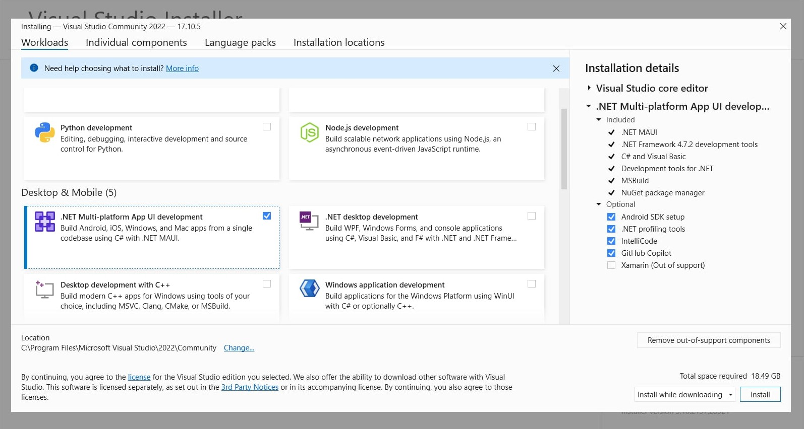</img>
</div><br>

* If the system requires to update Visual Studio to the newest version, please follow that.

## Installation
Before running the project, installation is made. To install and open the project, follow the following steps.
* First, clone the project into a local device for use and testing
```
git clone https://github.com/tongngocminhanh/MAUI_App_SDR.git
```
* Second, navigate the solution directory of the app. The solution is located on *\local directory\MAUI_App_SDR\MyCloudProject*. 
* Open *MyCloudProject.sln* with Visual Studio.
* To run or build the app with Visual Studio on a Windows device, create a folder named *Properties* under *\local directory\MAUI_App_SDR\MyCloudProject\AppSDR* and include the *launchSettings.json* file, content as follows.

```json
{
    "profiles": {
      "Windows Machine": {
        "commandName": "MsixPackage",
        "nativeDebugging": false
      }
    }
}
```

* Remember to build the solution, then the result will look like the image. This step enables the Windows mode, so users can operate AppSDR v2.0 on Windows local device.

<div style="text-align:center">
  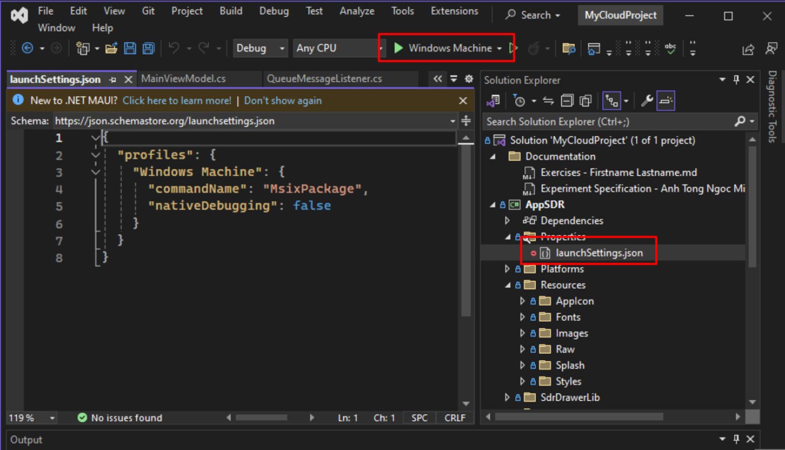</img>
</div><br>

* There might be some Nuget packages on your device not up-to-date. Therefore, open the manager by right-clicking the *AppSDR* on Visual Studio, and choose *Manage the NuGet Package*. Then update all the installed packages. 

<div style="text-align:center">
  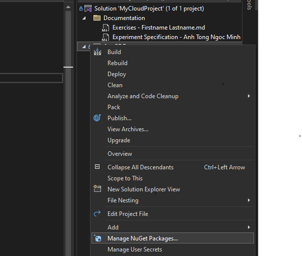</img>
</div><br>

* Then users should ensure the the following Android SDKs and Tools are enabled. Access to Android SDK Manager to check that.

<div style="text-align:center">
  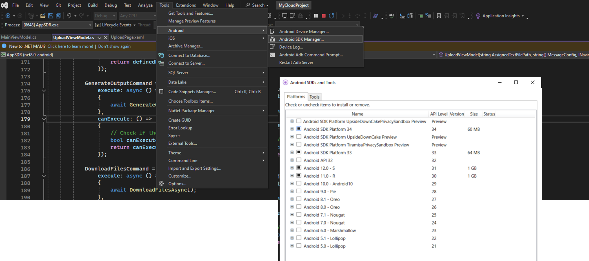</img>
</div><br>

* Users should also check the Developer mode, ensure that it is turned on.

<div style="text-align:center">
  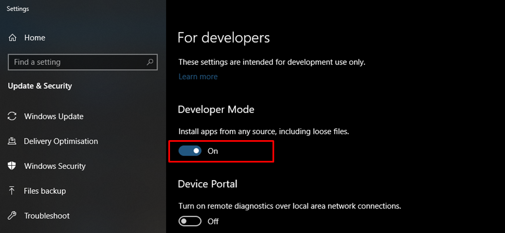</img>
</div><br>

Now, the app is ready to run.

## How to run
As mentioned, there are four cases described in this document. All cases start with the same opening step. We first click the *Windows Machine*.

<div style="text-align:center">
  </img>
</div><br>

When clicking the *Windows Machine* button, the AppSDR is loaded and the *Main Page* is shown. For Cloud-relevant functions, care from the label *Manually add SDR values* downward.

<div style="text-align:center">
  </img>
</div><br>

We can see from the *Main Page*:
* The *Table Entry* has eight blank spaces, corresponding to the eight parameters we need for our operation: Graph Name, Max Cycles, Highlight Touch, X-Axis Title, Y-Axis Title, Min Range, and Max Range. We should be careful that Max Cycles, Highlight Touch, Min Range, and Max Range contain numbers only, while the rest can be in number or text form.

* The *Add Text* button is invalid as the parameters table above is empty. make sure to enter ALL the entities to enable this button.

* The *Cloud configuration* button is clickable whether the parameters are given or not, we can see the differences in Case 1 and Case 3.

* The *Message Configuration* has three text editor spaces to handle text inputs, applied in Case 4. Only when the three blocks are not empty, can we click the *Upload Message* button.

### Case 1
**Input parameters**: First, we enter the table entities, the following is the example for the parameters. For the number type entities, try to apply the low value for *Min range*, and high values for *Max cycles, Max range*, so most Input SDR values can fit in the constraint. 

```
Parameters
- Graph name: Sample graph
- Max cycles: 1500
- Highlight touch: 3
- X axis title: SDR columns
- Y axis title: SDR values
- Min range of cell: 0
- Max range of cell: 10000
- Saved figure name: SavedSDR
```

Then we click the *Cloud configuration* button and move to *Upload Page*.

<div style="text-align:center">
  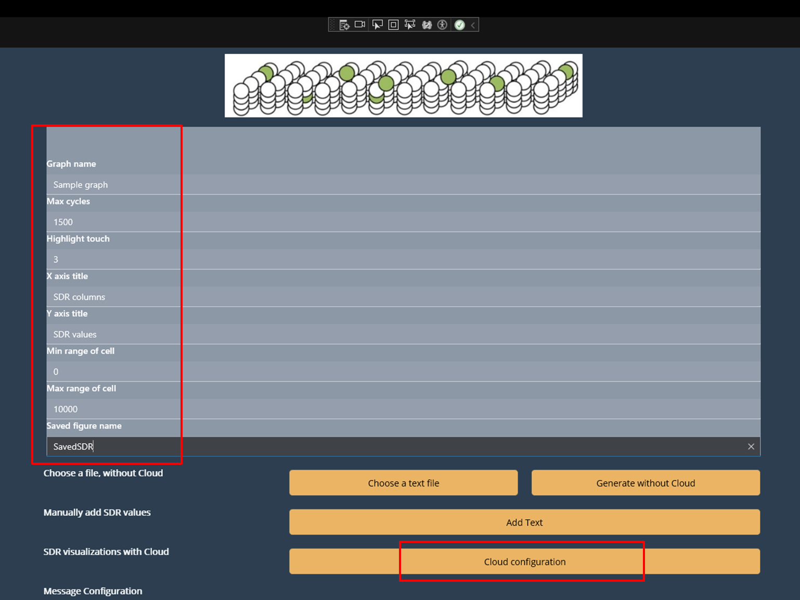</img>
</div><br>

Now, we are on the *Upload Page*. We can see, there are two parts: the left side and the right side. The left side has blank editors and buttons, while the right side has buttons only. The grey buttons are not accessible as their operating conditions are missed. The yellow buttons are clickable.

<div style="text-align:center">
  </img>
</div><br>

Then, the next operation steps are illustrated.

**Input information for Storage Account 1**:  *Configure Storage* part has two editors to hold the Connection String and the Storage Name. We enter the two editors with the content only, without blank space or Enter key.The sample is 

```
Storage account 1
- Connection String: DefaultEndpointsProtocol=https;AccountName=mauiprojectcloud;AccountKey=gDYct5X+8L0wUco6yIYFSvfdh/1UbwYmAAashjpETQ1czbYjS/1dtdgdhW0pjOlQoqmWqbAbXslb+AStiMasTw==;BlobEndpoint=https://mauiprojectcloud.blob.core.windows.net/;QueueEndpoint=https://mauiprojectcloud.queue.core.windows.net/;TableEndpoint=https://mauiprojectcloud.table.core.windows.net/;FileEndpoint=https://mauiprojectcloud.file.core.windows.net/;

- Storage Account Name: mauiprojectcloud-1
```

**Connect to Storage Account 1**: we can connect to *Storage Account 1* by clicking *Connect*. We will see on the left side, there is a red status showing that AppSDR has connected to *Storage Account 1*, and the *Upload defined parameters* button turns yellow. While on the right side, the upper three buttons turn yellow. 

<div style="text-align:center">
  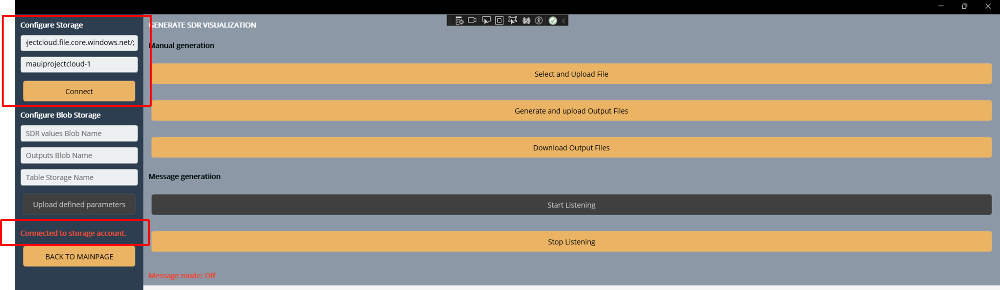</img>
</div><br>

**Input Blobs and Table container name**: next, we enter the *Configure Blob Storage* editors with values:

```
SDR values Blob Name: sdrfiles
Outputs Blob Name: saveoutput
Table Storage Name: parameters
```
**Upload parameters**: by clicking *Upload defined parameters*, the status updates with the successful notification. The eight parameters are uploaded to the Table Container.

<div style="text-align:center">
  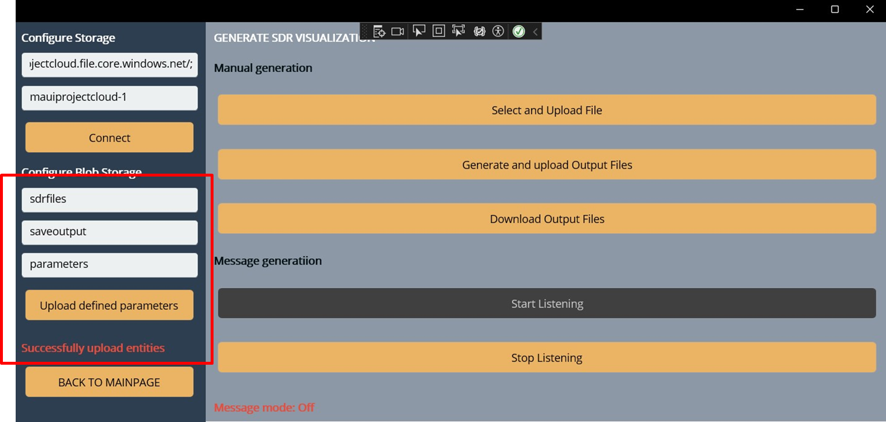</img>
</div><br>

**Choose and upload files**: then, we choose the input files by clicking the "Select and Upload File" button. The AppSDR will access the local device memory, pop up the choosing screen, and allow the user to choose multiple files. The file extension ".txt, .csv" is supported, so only .txt and .csv files are shown on the screen. This experiment takes the sample files from [TestSamples](../Documentation/TestSamples/), having two .txt files - [samplerandom.txt](../Documentation/TestSamples/samplerandom.txt) and [sampleZero](../Documentation/TestSamples/sampleZero.txt), and a .csv file - [sampleSheet](../Documentation/TestSamples/sampleSheet.csv). The content contains numbers and rows of numbers. Each number presents the SDR values separated by "," for .txt files, or column for .csv files. Each row presents an SDR column, a collection of SDR values. Here is a simple example of the .txt file content.

```
1541, 6, 12, 2573, 1044, 1557, 3608, 1049, 3503, 3619, 3590, 2605, 3630, 2609
2560, 2565, 2568, 524, 2077, 1568, 2088, 1066, 1287, 49, 51, 3126, 2618, 3138
```

After selecting the needed files, we click *Open* on the pop-up screen, it is automatically closed. The left status updates with successful notification.

<div style="text-align:center">
  </img>
</div><br>

**Generate and upload outputs**: finally, the *Generate and upload Output Files* button is clicked. We will wait for the output generation on *Page 1*.

<div style="text-align:center">
  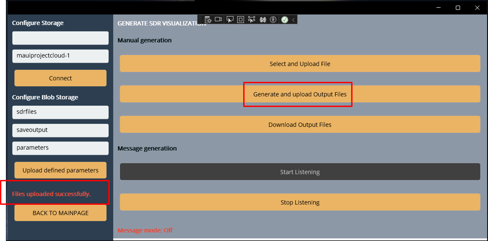</img>
</div><br>

**Outputs**: We check the content of the Storage Containers to prove that AppSDR v2.0 uses the Azure Cloud for its SDR visualization operation.

* First, we check the *SDR files Blob* and the *Parameters Table*. We can see that the input files are stored in *sdrfiles* Blob, keeping the files' format.

* For the *parameters* Table, the parameters are stored in one table entity having 11 properties: three default one, and eight entered one. The type of the input's parameters is defined as String, though we configure some of the parameters as Integer. This does not affect the operation, as AppSDR v2.0 has functions to always let the parameter be an accurate type for operation.


<div style="text-align:center">
  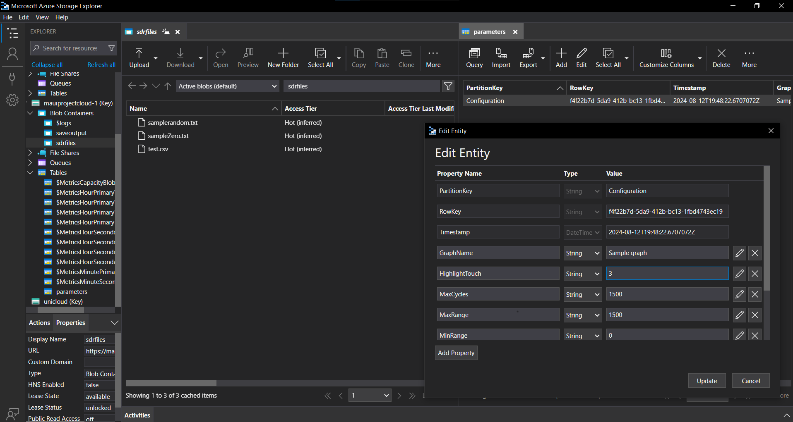</img>
</div><br>

* Second, we check the visualizations that appear on the AppSDR's UI and are saved on the *Output Blob*. There are three input files and one input table entity, so three visualizations are shown, and three image files are saved. The initial of the file's name is the same with the *SavedName* we configure. The following result happens when we click all *OK* on the pop-ups of *Page 1*. 

<div style="text-align:center">
  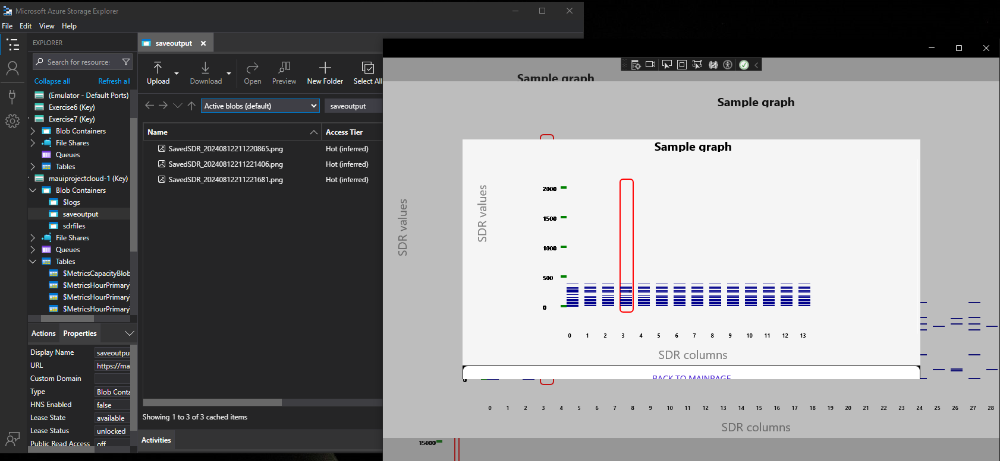</img>
</div><br>

* Navigation back to *Main Page* is possible with the *BACK TO MAIN PAGE* button on the final output. If it is not visible, scroll down the page a little bit.

### Case 2
Case 2 operation steps can be described in the figure below. The experiment has two different steps compared to Case 1: an extra step in red for **Enter SDR values in Text Editor and Save that into a .txt file**, and a replacement of **SDR values in Text Editor and Save that into a .txt file** with **Choose and upload files**. This sub-section only describes the different steps. For the identical one, please check [Case 1](#case-1).

<div style="text-align:center">
  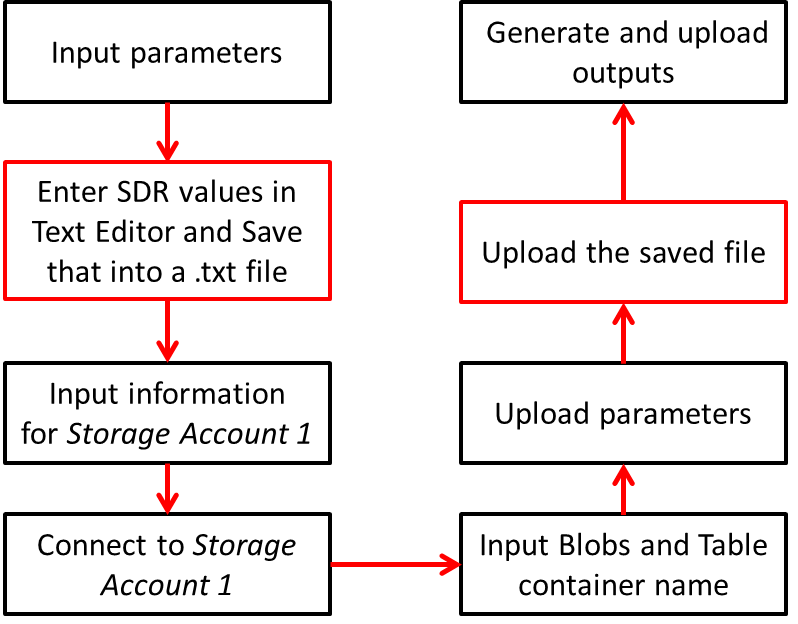</img>
</div><br>

**Input parameters**: see the ''Input parameters'' in Case 1, and use the same parameters.

This test case is triggered when all the table entities are full. Then the "Add Text" button is accessible.
* Click the "Add Text" button and move to *Text Editor Page*.

<div style="text-align:center">
  </img>
</div><br>

**Enter SDR values in Text Editor and Save that into a .txt file**: in *Text Ediotr Page*, instruction is given on the top, follow that and enter the SDR values. Check the sample below.

```
1541, 6, 12, 2573, 1044, 1557, 3608, 1049, 3503, 3619, 3590, 2605, 3630, 2609
2560, 2565, 2568, 524, 2077, 1568, 2088, 1066, 1287, 49, 51, 3126, 2618, 3138
3205, 1027, 1540, 1029, 3078, 519, 3069, 526, 1039, 3600, 3601, 1554, 3, 3587
3205, 3789, 901, 577, 3338, 1675, 12, 2573, 4013, 1936, 3985, 1298, 1683, 1044
2560, 899, 3962, 2950, 392, 2186, 3991, 524, 2829, 2447, 1680, 2706, 2195, 2905
```

* Then we click "Generate an image with Cloud"and move to *Upload Page*.

<div style="text-align:center">
  </img>
</div><br>

**Input information for Storage Account 1, Connect to Storage Account 1, Input Blobs and Table container name, Upload parameters**: please check the corresponding steps in [Case 1](#case-1).

**Upload the saved file**: the entered text is saved as a text file on Desktop, and when "Select and Upload File" is clicked, the app automatically chooses the saved file to upload.

**Generate and upload outputs**: check the same step in [Case 1](#case-1).

**Outputs**: We check the content of the Storage Containers to prove that AppSDR v2.0 uses the Azure Cloud for its SDR visualization operation.

* First, we check the *SDR files Blob* and the *Parameters Table*. We can see that one input file are stored in *sdrfiles* Blob, in text format.

* For the *parameters* Table, the parameters are stored in one table entity having 11 properties: three default one, and eight entered one. The type of the input's parameters is defined as String, though we configure some of the parameters as Integer. This does not affect the operation, as AppSDR v2.0 has functions to always let the parameter be an accurate type for operation. 

<div style="text-align:center">
  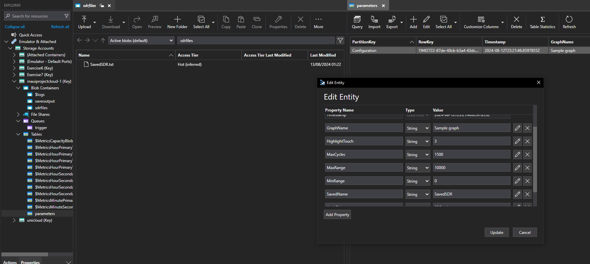</img>
</div><br>

* Second, we check the visualization that appear on the AppSDR's UI and is saved on the *Output Blob*. There are one input text file and one input table entity, so one visualization appears, and one image files are saved. The initial of the file's name is the same with the *SavedName* we configure. The following result happens when we click all *OK* on the pop-ups of *Page 1*. 

<div style="text-align:center">
  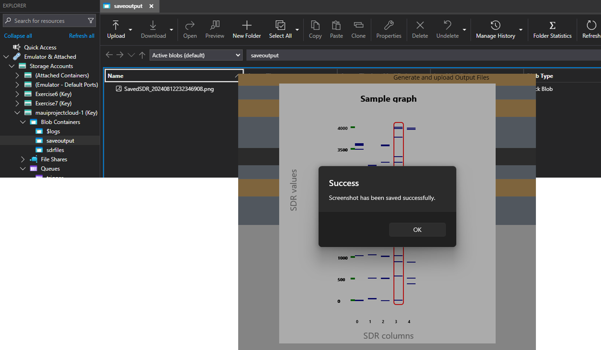</img>
</div><br> 

### Case 3
Case 3 is the shorter version of case 1; therefore, we can take advantage of input values in case 2, and operatation steps in case 1. The next diagram shows the four steps of SDR visualization.

<div style="text-align:center">
  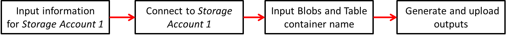</img>
</div><br>

To run test case 3, we need to check the Storage content. The figure shows that we inherit the input file from Case 2 and parameters from Case 1. Therefore, the *Output Blob* will have one image file, and the SDR visualization on AppSDR UI is similar to "Output Representation" in [Case 2](#case-2). 

<div style="text-align:center">
  </img>
</div><br>

* Directly click *Cloud Configuration* on *Main Page*, and move to *Upload Page*. No parameter is defined.

<div style="text-align:center">
  </img>
</div><br>

**Input information for Storage Account 1, Connect to Storage Account 1, Input Blobs and Table container name, Upload parameters, Generate and upload outputs**: please check the corresponding steps in [Case 1](#case-1).

**Outputs**: look similar to [Case 2](#case-2).

### Case 4
To run test case 4, we need to check the Storage content. As we can see from the figure, we adopt the input files and parameters from Case 1. Therefore, the *Output Blob* will have three image files, and the SDR visualization on AppSDR UI is similar to "Output Representation" in [Case 1](#case-1). 

<div style="text-align:center">
  </img>
</div><br>

**Input information for MESSAGE operation**: we enter the *Message Configuration* editors: Connection String of *Storage Account 2*, the Queue name, and the MESSAGE content. *Storage Account 1* can be used as *Storage Account 2*, so this experiment takes the Connection String 1. There is no restriction for the Queue name, as AppSDR will check if the Queue exists and create one when there is no defined Queue. MESSAGE has the JSON format, containing: Connection String of Storage Account 1, two Blobs names, and one Table name. Please copy for Connection String, and MESSAGE content with no extra space, and Enter-key.

```
Connection String: DefaultEndpointsProtocol=https;AccountName=mauiprojectcloud;AccountKey=gDYct5X+8L0wUco6yIYFSvfdh/1UbwYmAAashjpETQ1czbYjS/1dtdgdhW0pjOlQoqmWqbAbXslb+AStiMasTw==;BlobEndpoint=https://mauiprojectcloud.blob.core.windows.net/;QueueEndpoint=https://mauiprojectcloud.queue.core.windows.net/;TableEndpoint=https://mauiprojectcloud.table.core.windows.net/;FileEndpoint=https://mauiprojectcloud.file.core.windows.net/;

Queue Storage Name: trigger

MESSAGE:
{
"StorageConnectionString":"DefaultEndpointsProtocol=https;AccountName=mauiprojectcloud;AccountKey=gDYct5X+8L0wUco6yIYFSvfdh/1UbwYmAAashjpETQ1czbYjS/1dtdgdhW0pjOlQoqmWqbAbXslb+AStiMasTw==;BlobEndpoint=https://mauiprojectcloud.blob.core.windows.net/;QueueEndpoint=https://mauiprojectcloud.queue.core.windows.net/;TableEndpoint=https://mauiprojectcloud.table.core.windows.net/;FileEndpoint=https://mauiprojectcloud.file.core.windows.net/;",
"UploadBlobStorageName": "sdrfiles",
"DownloadBlobStorageName": "saveoutput",
"TableStorageName": "parameters"
} 
```
**Upload MESSAGE**: after clicking *Upload Message*, a pop-up appears with the successful message.

<div style="text-align:center">
  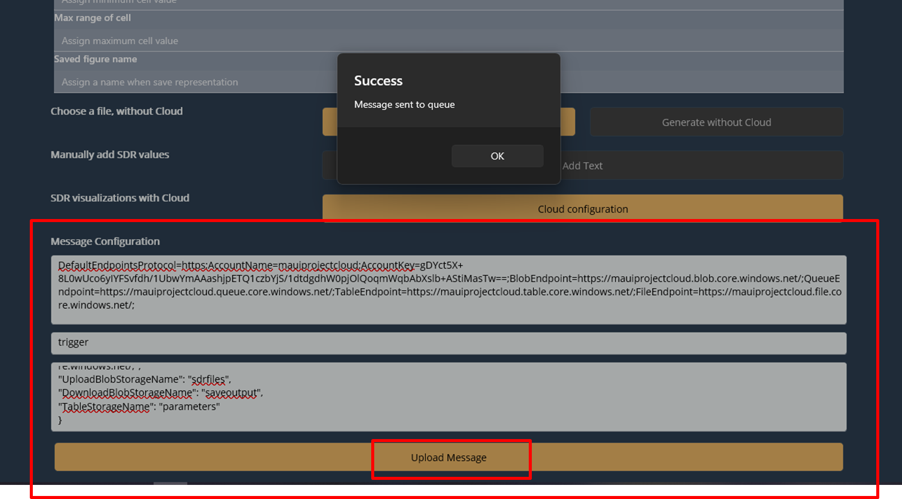</img>
</div><br>

After uploading, we check in *trigger* Queue, there is a message with the content like the figure.

<div style="text-align:center">
  </img>
</div><br>

**Start Listening Mode**: then turn off the *OK* on pop-up and click *Cloud Configuration* to move to *Upload Page*. We can see that *Start Listening* is yellow, meaning we can click that button. After clicking, we wait for the outputs. No extra inputs are required.

<div style="text-align:center">
  </img>
</div><br>

**Outputs**: are similar to ''Outputs'' in [Case 1](#case-1). In addition to the same outputs, we should check the Queue Storage content. The MESSAGE should be removed from *trigger* Queue.

<div style="text-align:center">
  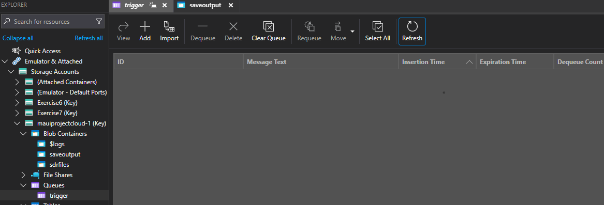</img>
</div><br>

Further implementation information can be found [here](./Experiment%20Specification%20-%20Anh%20Tong%20Ngoc%20Minh%20-%20Son%20Pham%20Tien.md).