# User manual for new version AppSDR
This document provides detailed instructions for using the new version of *AppSDR* in Windows. For continuous operation, and repeating steps prevention, this document shows information from the *How to run* section. *Prerequisite and Installation* can be checked on the initial [User Manual](../../MySEProject/Documentation/UserManual.md).
## Table of contents

* [How to run](#how-to-run)
  * [Parameters and multiple SDR files](#parameters-and-multiple-sdr-files)
  * [Parameters and text editor](#sdr-values-as-text-editor)
  * [No uploaded parameters and files](#no-uploaded-parameters-and-files)
  * [Message generation](#message-generation)
* [Output representation](#output-representation)
* [License](#license)

## How to run
AppSDR has two stages of running: Without- and With-Cloud. This document specifies the With-Cloud method, as the Without-Cloud one remains unchanged. After the installation step, the following screen is shown when opening the solution file. Because of the *launchSetting.json*, a state of *Windows Machine* is available for debugging. 

  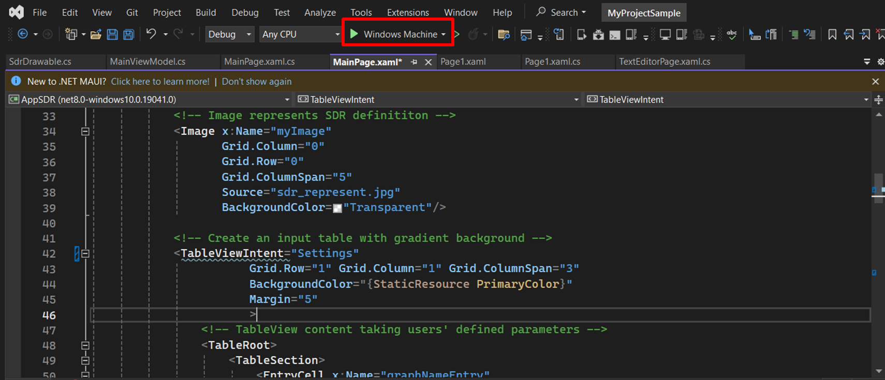</img>

 

When clicking the *Windows Machine* button, the AppSDR is loaded and the *Main Page* is shown. For Cloud-relevant functions, consider from the label *Manually add SDR values* downward.

  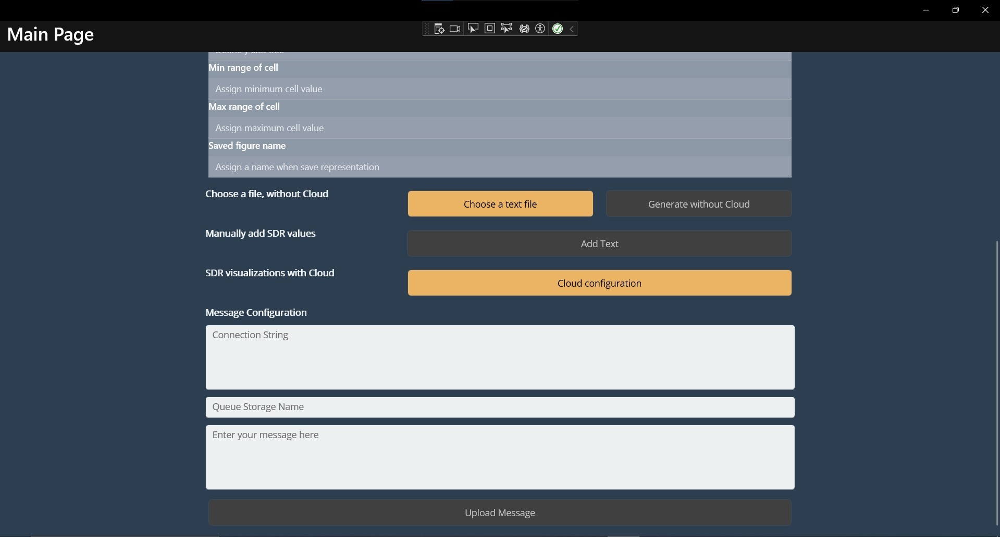</img>

 

* The *Add Text* button is invalid as the parameters table above is empty. make sure to enter ALL the entities in the table to enable this button.
* The *Cloud configuration* button is clickable whether the parameters are given or not. The differences are mentioned in the test cases below. 
* The *Message Configuration* has three text editor spaces to handle text inputs. Only when the three blocks are not empty, can the *Upload Message* be functional.

### Parameters and multiple SDR files
This case requires input parameters and multiple SDR files. Therefore, users enter eight table entities and click *Cloud Configuration* to navigate to *Upload Page*. The parameters are passed to *Upload Page*.

* When *Upload Page* is up, Cloud information can be defined here.
* As the app does not connect to Storage Account yet, the buttons *Manual generation* are not valid.

  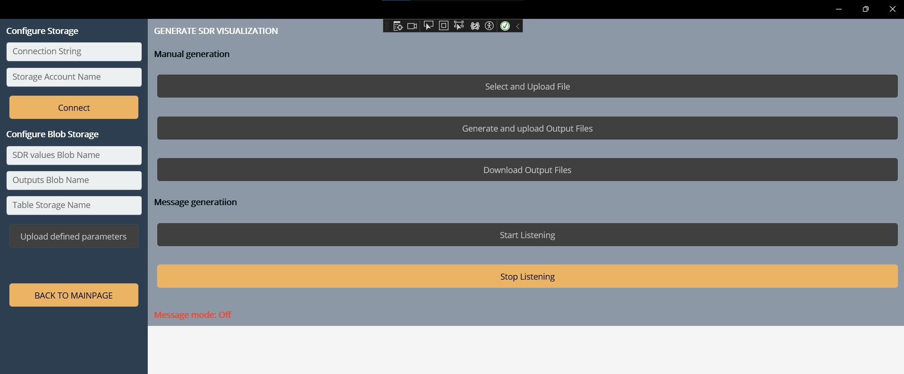</img>

 

* When enter the Storage Account information and click "Connect, a status message on the left appeears. At the same time, the "Manual generation" functions are proccessable.

  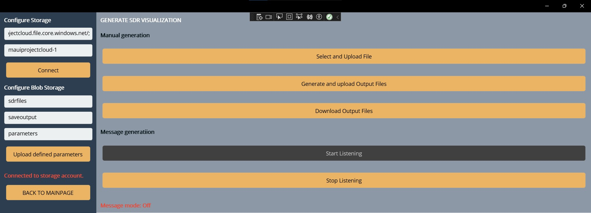</img>

 

* For parameters upload, *Configure Blob Storage* should be fully filled out. After that, *Upload defined parameters* is clickable.
* Upload the parameters by clicking that button. The status message is updated with successful notification.

  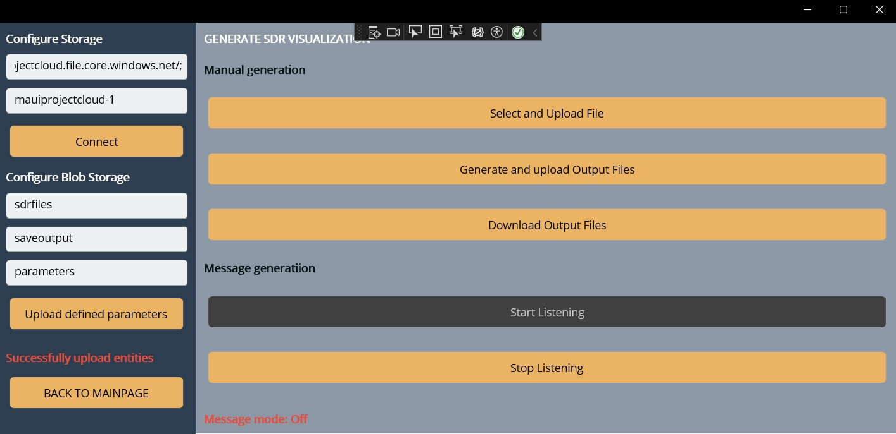</img>

 

* Then, user should choose the inputs files by clicking "Select and Upload File".
* AppSDR will access the local device memory, pop up the choosing screen, and allow the user to choose multiple file. The file extension of ".txt, .csv" is supported, so on the screen, only text files and csv files are shown. After choosing the files, the pop-up screen is automatically closed.

  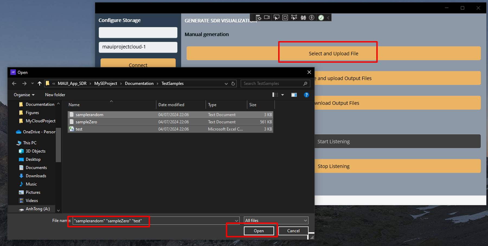</img>

 

* Finally, the "Generate and upload Output Files" is chosen. Wait for the output generation.

### Parameters and text editor
This test case is triggered when all the table entities are full. Then the "Add Text" button is accessible.
* Click the "Add Text" button and move to *Text Editor Page*.

  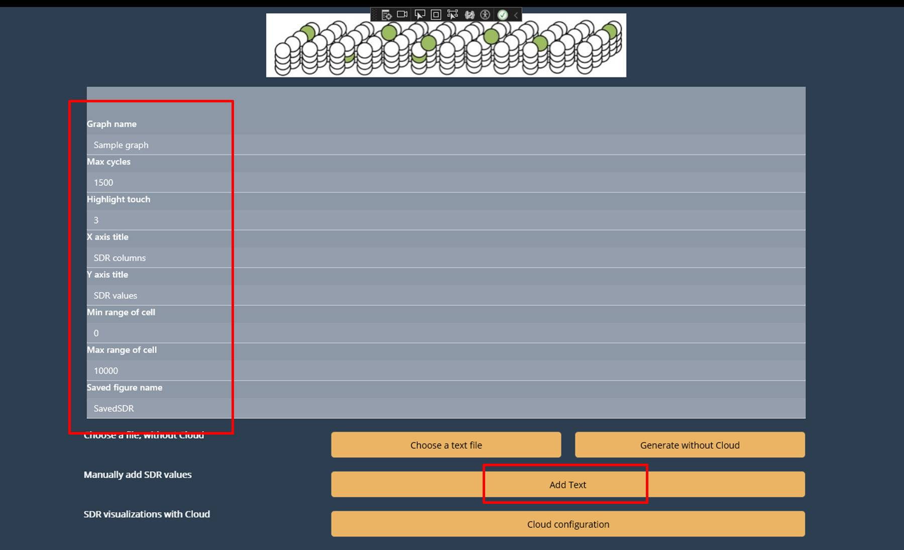</img>

 

* In this page, instruction is given on the top, follow that and enter the SDR values. The click "Generate an image with Cloud"and move to *Upload Page*. 

* The entered text is saved as a text file on Desktop, and when "Select and Upload File" is clicked among the following steps, the app automatically chooses the saved file to upload.

  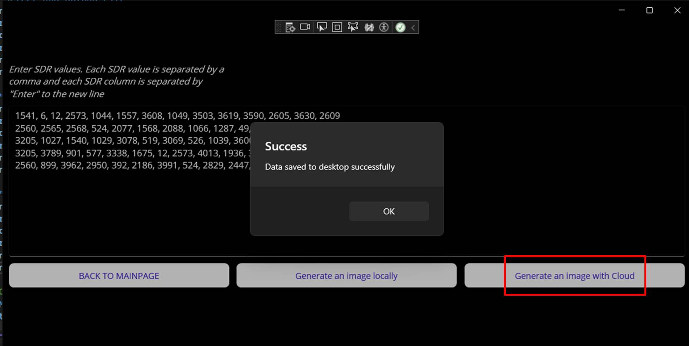</img>

 

* When user is on *Upload Page*, the next steps are the same as the *Upload Page* ones in [Parameters and multiple SDR files](#parameters-and-multiple-sdr-files).

### No uploaded parameters and files
If it is verified that SDR file Blob and Parameters Table Container have values, users can run the operation after connecting to the Atorage Account and specified the containers. 

* Directly click *Cloud Configuration* on *Main Page*, and move to *Upload Page*. No parameter is defined.
* When on *Upload Page*, enter the "Configure Storage' and connect to the Storage Account by clicking "Connect".
* Enter the other container names in "Configure Blob Storage". Because no parameters are defined, the *Upload defined parameters* is not clickable.

  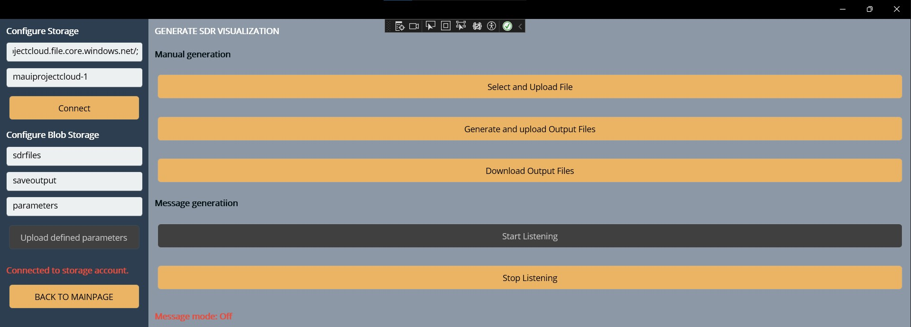</img>

 

* Click *Generate and upload Output Files* and wait for the visualization.

### Mesage generation 
AppSDR can give output with MESSAGE trigger. User uploads a MESSAGE to a Queue Container, being different or the same with the working Storage Account. 
* The three *Message Configuration* spaces are filled, then the *Upload Message* button is valid.
* After clicking *Upload Message*, a pop-up appears with the successful message. Click "OK", and choose the *Cloud Configuration* button next.

  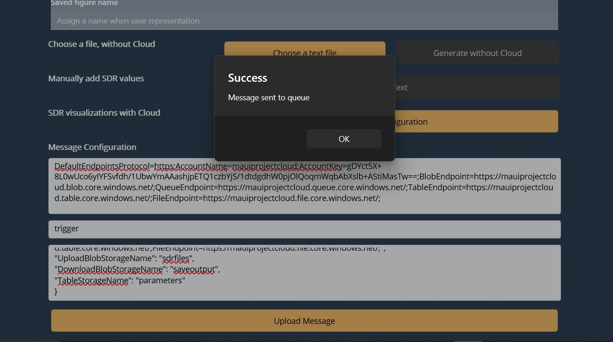</img>

 

* Only when the message is uploaded, is the *Start Listening* button valid. 

  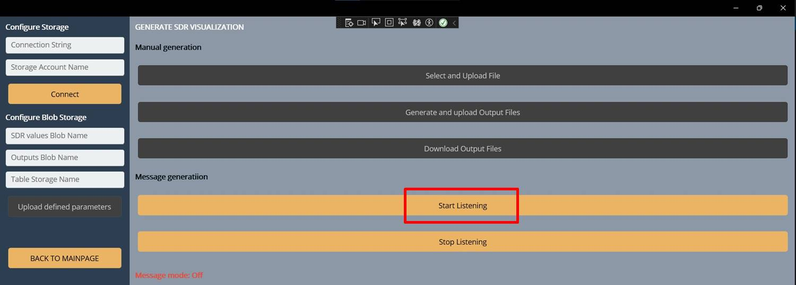</img>

 

* Click *Start Listening* and wait for the outputs. No extra inputs are required.

## Output representation
All of the cases generate the same form of output. 
* If there is only one SDR file, the output is the *Page 1* visualization. *Page 1* appears on top of the *Upload Page*.

  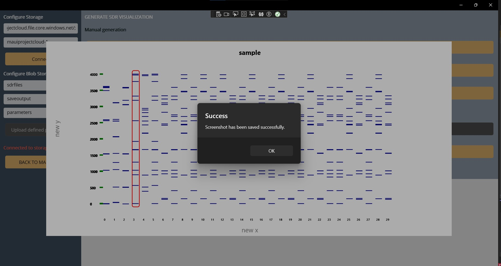</img>

 

* If there are multiple files in the Blob Containers or several parameter definitions in the Table Container, AppSDR draws all the possible combinations with *Page 1*. Each output will be over one other.

  </img>

 

* When click "OK", visualization is uploaded in the Output Blob Container as an image file. Each output will have its own "OK" pop-up message.
* Navigation back to *Main Page* is possible with the *BACK TO MAIN PAGE* button on the final output. If it is not visible, scroll down the page a little bit.

Further implementation information can be found [here](./Experiment%20Specification%20-%20Anh%20Tong%20Ngoc%20Minh%20-%20Son%20Pham%20Tien.md).

## License
[MIT License](LICENSE)