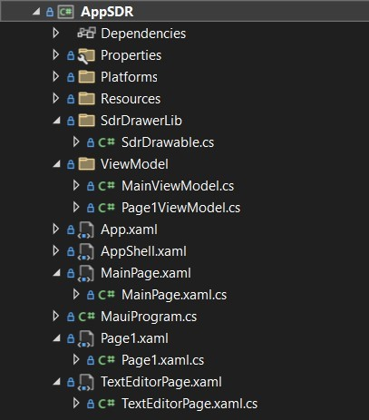
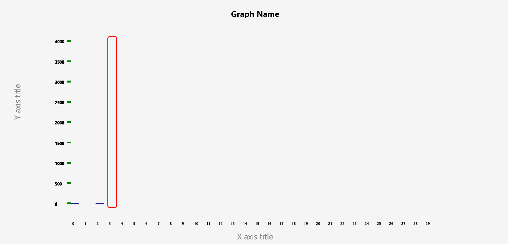

# ML22-23-8 Implement the SDR representation in the MAUI application

 This project requires the implementation of a .NET Multi-platform App User Interface (.NET MAUI) app for visualizing the SDR representations. The app is compatible in Windows, Android, and IOS devices. This includes generating a UI for parameters setting and file input with XAML, binding data for application and logic with Model-View-ViewModel (MVVM) and XAML, using of Maui.Graphics for generating a new SDR drawing library.  

## Table of contents
1. [Introduction](#introduction)
2. [Important Links](#important-links)
3. [Getting Started](#getting-started)
4. [Implementation of MAUI App](#implementation-of-maui-app)
    * [UI implementation](#ui-implementation)
    * [Logic implementation](#logic-implementation)
    * [SDR drawing library implementation](#sdr-drawing-library-implementation)
5. [Testing and evaluation](#testing-and-evaluation)
6. [References](#references)

## Introduction
.NET MAUI is a cross-platform framework, dealing with real-time problems. The foundation of MAUI is to simplify multiplatform app development. Within a single project, users can add the platform-specific source code and resources if needed. The scope of the project is to show the hardware and software requirements, how to implement the MAUI app, evaluate the test results, and provide possible improvements. In general, the project involves
* Create a User Interface (UI) in the MAUI app so users can define required parameters, and input a file from local devices. The parameters for visual control of the output screen, while the input file contains data used for representation. The main idea in this part is to use XAML to set the method for inputting and Data binding to handle the data within the program.
* Modify the logic behind the UI elements, showing how the data binds together and being processed.
* Generate and implement an SDR drawing library to visualize the input data based on requirements. The library contains multiple functions used to clarify the content of the output. Therefore, for future improvements, developers can handle the library better. 

Based on the previous reference of the SDR representation generating file - [draw_figure.py](../../Python/ColumnActivityDiagram/draw_figure.py), the requirements are to create a MAUI app that could draw the similar SDR representation as the mentioned file. The result is directly loaded on the app UI, not in another HTML file. The app input can handle specific formats for files: CSV and TXT, and types for parameters: string, and numbers. Evaluations are made on "Windows machine" because of the bigger, better view and simple operation. 

## Important links
1. SE Project Documentation: [PDF](./ML22-23-8%20Implement%20the%20SDR%20representation%20in%20the%20MAUI%20application.docx)<br/>
2. UI implemenation files of Input Page, Text Input Page and Visualisation Page: [MainPage.xaml](../AppSDR/MainPage.xaml), [TextEditorPage.xaml](../AppSDR/TextEditorPage.xaml), [Page1.xaml](../AppSDR/Page1.xaml)<br/>
3. Logic implementation files of mentioned pages, in View Model: [MainViewmodel.cs](../AppSDR/ViewModel/MainViewModel.cs), [Page1ViewModel.cs](../AppSDR/ViewModel/Page1ViewModel.cs)
4. Logic implementation files of mentioned pages, in Model: [MainPage.cs](../AppSDR/MainPage.xaml.cs), [TextEditorPage.xaml.cs](../AppSDR/TextEditorPage.xaml.cs), [Page1.xaml.cs](../AppSDR/Page1.xaml.cs)<br/>
5. SDR drawing file: [SDRDrawerable.cs](../AppSDR/SdrDrawerLib/SdrDrawable.cs)<br/>
6. Project solution: [MyProjectSample.sln](../MyProjectSample.sln)

## Getting started
The project integrates the latest update; therefore, the suggestion is to install at least the following version of IDE, text editor, and MAUI.
* Microsoft Visual Studio Community 2022 - v17.8.6 - https://learn.microsoft.com/en-us/visualstudio/releases/2022/release-notes-v17.8
* .NET MAUI 8.0 - when installing Visual Studio, choose .NET MAUI to integrate along with the installation. From the version of v17.8.6, .NET MAUI 8.0 will be automatically supported.

Detailed information can be found on [MySEProject](https://github.com/tongngocminhanh/MAUI_App_SDR/tree/master/MySEProject).

## Implementation of MAUI App
When building a .NET MAUI app, developers could work on one specific platform, normally Windows. To display on other platforms, .NET MAUI auto-generates the compatible code for that platform. For this project, specification on Windows is provided, based on the general architecture below.

<div style="background-color: #ffffff; text-align:center">
  </img>
</div><br>

The project's idea is to draw SDR representations from users' SDR data and visualization specifications. Therefore, users must input the program in two orders: 
* Parameters to define the graphical output of the required representation. The program uses *Main Page* to collect the parameters, parsing them to *Text Editor Page* and *Page 1* depending on the user's intention.
* An input text file (.txt) or sheet files (.csv) feeding the SDR data into the program. Another method to input SDR data is directly entering values from keyboards. In both cases, the data is parsed into *Page 1* for visualizing SDR representations with the help of the *SDRDrawerLib* library.

The main structure for the app is illustrated by the following figure, in which all the attending pages are created with .NET MAUI ContenPage (XAML), *ViewModel* folder containing C# classes used for the logic behind, and *SdrDrawerLib*, a new library used for SDR drawing. Class *SdrDrawable* is in charge of configuring the visualization of SDR. This class is called on *Page 1*, as the drawing output is shown here. 

<div style="text-align:center">
  </img>
</div><br>

Details on implementation configuration and steps are explained in the next subsections.

### UI implementation
### Logic implementation
### SDR drawing library implementaion

Class *SdrDrawable()* is the SDR drawing c# class, included in folder *SdrDrawerLib* of *AppSDR*. For drawing properties, this class uses two libraries as in the following figure. *System.ComponentModel* is used for any changing variables, and *Microsoft.Maui.Graphics* is used for specifying the *Font* internal variable, and allows the ICanvas drawing interface. 

```csharp
using System.ComponentModel;
using Font = Microsoft.Maui.Graphics.Font;
```

Seven parameters need to be initialized when the class is first called in the project. They are *GraphName, MaxCycles, and HighlightTouch, XAxisTitle, YAxisTitle, MinRange, and MaxRange*. These are not normally changed. In addition, there are four public variables, that can be assigned later when needed. The initialization of variables is shown below. They can be changed multiple times.

The *Draw(canvas, dirtyRect)* is the primary function, must-generated when assigning *SdrDrawable()* with the *IDrawable* interface. This function includes primary functions, depending only on the initial parameters. When this function is called, all functions defined are executed.

```csharp
namespace AppSDR.SdrDrawerLib
{
    public class SdrDrawable : BindableObject, IDrawable, INotifyPropertyChanged
    {
        public RectF IRect { get; set; }
        public string GraphName { get; set; }
        public int? MaxCycles { get; set; }
        public int? HighlightTouch { get; set; }
        public string XAxisTitle { get; set; }
        public string YAxisTitle { get; set; }
        public int? MinRange { get; set; }
        public int? MaxRange { get; set; }
        public float RectangleWidth { get; set; }
        public float RectangleSpacing { get; set; }
        public float XCanvas { get; set; }

        // Constructor to initialize the properties
        public SdrDrawable(string graphName, int? maxCycles, int? highlightTouch, string xAxisTitle, string yAxisTitle, int? minRange, int? maxRange)
        {
            GraphName = graphName;
            MaxCycles = maxCycles;
            HighlightTouch = highlightTouch;
            XAxisTitle = xAxisTitle;
            YAxisTitle = yAxisTitle;
            MinRange = minRange;
            MaxRange = maxRange;
        }

        public void Draw(ICanvas canvas, RectF dirtyRect)
        {
            // Basic drawing functions when called Draw()
            DrawInnerBorder(canvas, dirtyRect);
            DrawNameFit(canvas, dirtyRect); 
            DrawXAxisExtend(canvas, IRect);
            DrawYAxis(canvas, IRect);
            DrawNameFit(canvas, IRect);
            DrawNameExtend(canvas, IRect);
        }

        // Further code ...
    }
}
```
After initialization of the used parameter, next is the multiple distinguished drawing functions. Necessary parameters are defined on the method signature. The components include specifications as: the availability of the function, *public void* in this case, the function name, and used-parameter names along with their types. All of the created drawing functions are shown below.

```csharp
        public void DrawInnerBorder(ICanvas canvas, RectF dirtyRect)
        {
            // Code for drawing inner border...
        }

        public void DrawXAxisFit(ICanvas canvas, RectF IRect)
        {
            // Code for drawing X axis fit...
        }

        public void DrawXAxisExtend(ICanvas canvas, RectF IRect)
        {
            // Code for drawing X axis extend...
        }

        public void DrawYAxis(ICanvas canvas, RectF IRect)
        {
            // Code for drawing Y axis...
        }

        public void DrawNameFit(ICanvas canvas, RectF IRect)
        {
            // Code for drawing name fit...
        }

        public void DrawNameExtend(ICanvas canvas, RectF IRect)
        {
            // Code for drawing name extend...
        }

        public void DrawHighlight(ICanvas canvas, RectF IRect, int maxCellValue)
        {
            // Code for drawing highlight...
        }

        public void DrawColumnNumber(ICanvas canvas, RectF dirtyRect, int column, float X)
        {
            // Code for drawing column number...
        }

        public void DrawTickMark(ICanvas canvas, RectF dirtyRect, int maxCellValue, float tickWidth, float tickSpacing)
        {
            // Code for drawing tick mark...
        }

        public void DrawTickLabel(ICanvas canvas, float tickValue, float tickStartX, float tickY)
        {
            // Code for drawing tick label...
        }
```
The primary idea of all drawing functions is based on three *ICanvas* methods:
* DrawString(string value, float x, float y, HorizontalAlignment horizontalAlignment, VerticalAlignment verticalAlignment)
* DrawRectangle(float x, float y, float width, float height)
* DrawRoundedRectangle(float x, float y, float width, float height, float cornerRadius)

The parameters are understood as below. The parameters are calculated and defined within the functions. For a detailed description of each function, please check the following [SdrDrawable.cs](../AppSDR/SdrDrawerLib/SdrDrawable.cs)
* *x, y* for the drawing position, with *x* for the horizontal axis, and *y* for the vertical axis.
* *width, height* for the size of the text or rectangle.
* *cornerRadius* defines how round the corners of a rectangle.
* *horizontalAlignment, verticalAlignment* specify the text-align on each axis.

The overview of the library is shown in the next figure. The graph has the *X axis title* at the center bottom of the screen, while the *Graph Name* is at the center top of the screen. The *Y axis title* is rotated anti-clockwise 90 degrees, placed at the right center of the graph. There are numbers specifying all the columns, division of the vertical axis (tick marks and division numbers), and the highlight column as specified. 

<div style="text-align:center">
  </img>
</div><br>

To be used in the project, called in *Page1ViewModel.cs*, include the library in the c# file. The library name is the namespace where it is used.
```csharp
using AppSDR.SdrDrawerLib;
```

Then in the main loop, assign a name class for *SdrDrawable*. All the initial parameters must be defined. Functions in the class can be called in logic file like in the example below. 

```csharp
SdrDrawable drawable = new SdrDrawable(graphName,maxCycles,highlightTouch,xAxisTitle,yAxisTitle,minRange,maxRange);
drawable.Draw(canvas, dirtyRect)
```
## Testing and evaluation

In this project, we have successfully implemented the MAUI app for visualizing SDR representation. Users can set the wanted parameters for the configuration of the graph. They also can input the file with the extension "CSV, TXT" containing data of Active Cells Columns, for visualization. For further improvement, the draw function in this App could be generated into one MAUI library and applied to other purposes.

## References

[Documentaion on MAUI creation and configuration ](https://learn.microsoft.com/en-us/dotnet/maui/?view=net-maui-8.0)

[Example videos of building the first MAUI app ](https://www.youtube.com/playlist?list=PLdo4fOcmZ0oUBAdL2NwBpDs32zwGqb9DY)