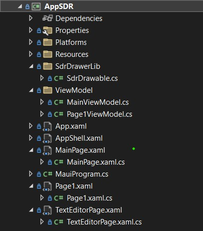
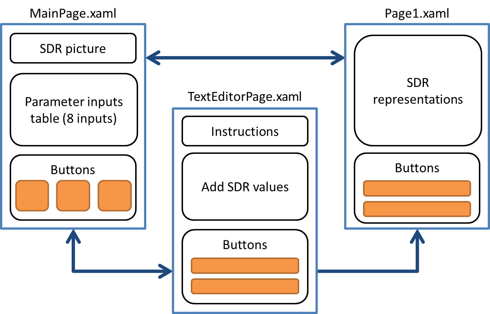
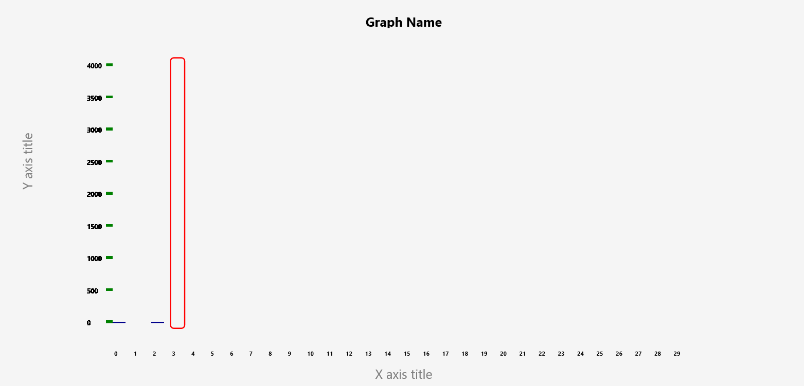
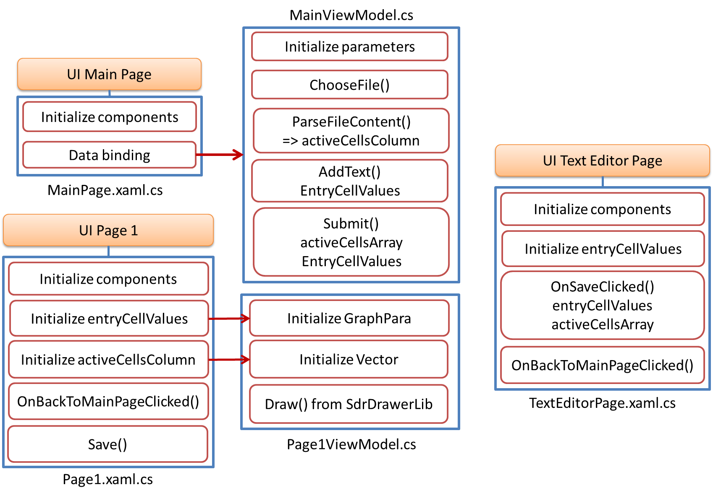
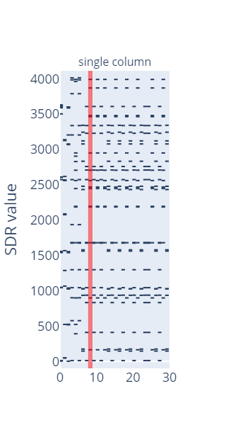
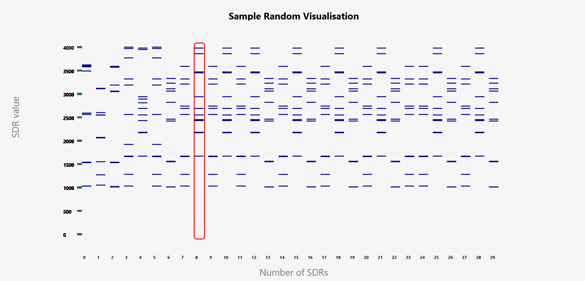

# ML22-23-8 Implement the SDR representation in the MAUI application

 This project requires the implementation of a .NET Multi-platform App User Interface (.NET MAUI) app for visualizing the SDR representations. This includes generating a UI for parameters setting and file input with XAML, binding data and logic with Model-View-ViewModel (MVVM) and XAML, using of Maui.Graphics for generating a new SDR drawing library.  

## Table of contents
1. [Introduction](#introduction)
2. [Important Links](#important-links)
3. [Getting Started](#getting-started)
4. [Implementation of MAUI App](#implementation-of-maui-app)
    * [UI implementation](#ui-implementation)
    * [SDR drawing library implementation](#sdr-drawing-library-implementation)
    * [Logic implementation](#logic-implementation)
5. [Testing and evaluation](#testing-and-evaluation)
6. [Changed files and new files](#changed-files-and-new-files)
6. [References](#references)

## Introduction
.NET MAUI is a cross-platform framework, with foundation of simplifying multiplatform app development. The scope of the project is to show the hardware and software requirements, how to implement the MAUI app, evaluate the test results, and provide possible improvements. In general, the project involves
* Create a User Interface (UI) in the MAUI app so users can define required parameters for visual control of the output screen, and input a file from local devices for representation. The main idea is to use XAML to set the method for inputting and data binding to handle the data within the program.
* Modify the logic behind the UI elements, showing how the data binds together and being processed.
* Generate and implement an SDR drawing library to visualize the input data based on requirements. The library contains multiple functions used to clarify the content of the output.

Based on the previous model of the SDR representation - [draw_figure.py](../../Python/ColumnActivityDiagram/draw_figure.py), the requirements are to create a MAUI app that could draw the similar SDR representation. The result is directly loaded on the app UI, not in another HTML file. The app input can handle specific formats for files: CSV and TXT, and types for parameters: string, and numbers. Evaluations are made on "Windows machine" as local device. 

## Important links
1. SE Project Documentation: [PDF](./ML22-23-8-Implement%20the%20SDR%20representation%20in%20the%20MAUI%20application_MAUI_App_SDR-Paper.pdf)<br/>
2. UI implemenation files of Input Page, Text Input Page and Visualisation Page: [MainPage.xaml](../AppSDR/MainPage.xaml), [TextEditorPage.xaml](../AppSDR/TextEditorPage.xaml), [Page1.xaml](../AppSDR/Page1.xaml)<br/>
3. Logic implementation classes of mentioned pages, in View Model: [MainViewModel()](../AppSDR/ViewModel/MainViewModel.cs), [Page1ViewModel()](../AppSDR/ViewModel/Page1ViewModel.cs)
4. Logic implementation class of mentioned pages, in Model: [MainPage()](../AppSDR/MainPage.xaml.cs), [TextEditorPage()](../AppSDR/TextEditorPage.xaml.cs), [Page1.xaml.cs](../AppSDR/Page1.xaml.cs)<br/>
5. SDR drawing file: [SdrDrawerable()](../AppSDR/SdrDrawerLib/SdrDrawable.cs)<br/>
6. Project solution: [MyProjectSample.sln](../MyProjectSample.sln)

## Getting started
The project integrates the latest update; therefore, the suggestion is to install at least the following version of IDE, text editor, and MAUI.
* Microsoft Visual Studio Community 2022 - v17.8.6 - https://learn.microsoft.com/en-us/visualstudio/releases/2022/release-notes-v17.8
* .NET MAUI 8.0 - when installing Visual Studio, choose .NET MAUI to integrate along with the installation. From the version of v17.8.6, .NET MAUI 8.0 will be automatically supported.

Detailed information can be found on [MySEProject](https://github.com/tongngocminhanh/MAUI_App_SDR/tree/master/MySEProject).

## Implementation of MAUI App
When building a .NET MAUI app in this project, specification on Windows is provided, based on the general architecture below.

<div style="background-color: #ffffff; text-align:center">
  </img>
</div><br>

The project's idea is to draw SDR representations from users' SDR data and visualization specifications. Therefore, users must input the program in two orders: 
* Parameters to define the graphical output of the required representation. The program uses *Main Page* to collect the parameters, parsing them to *Text Editor Page* and *Page 1* depending on the user's intention.
* An input text file (.txt) or sheet files (.csv) feeding the SDR data into the program. Another method to input SDR data is directly entering values from keyboards. In both cases, the data is parsed into *Page 1* for visualizing SDR representations with the help of the *SDRDrawerLib* library.

The main structure for the app is illustrated by the following figure, in which all the attending pages are created with .NET MAUI ContentPage (XAML), *ViewModel* folder containing C# classes used for the logic behind, and *SdrDrawerLib*, a new library used for SDR drawing. Class *SdrDrawable* is in charge of configuring the visualization of SDR. This class is called on *Page 1*, as the drawing output is shown here. 

<div style="text-align:center">
  </img>
</div><br>

Details on implementation configuration and steps are explained in the next subsections.

### UI implementation

The app has three pages interacting with users: *Main Page, Text Editor Page, Page 1*. The primary page, loaded when running *AppSDR*, is *Main Page*. In .NET MAUI, the user can define the primary page, via *AppShell.xaml*. The *App Shell* is the first accessed when running the MAUI app, holding the defined primary page and presenting its content. *AppShell.xaml* is presented in the code below.

```xaml
<?xml version="1.0" encoding="UTF-8" ?>
<Shell
    x:Class="AppSDR.AppShell"
    xmlns="http://schemas.microsoft.com/dotnet/2021/maui"
    xmlns:x="http://schemas.microsoft.com/winfx/2009/xaml"
    xmlns:local="clr-namespace:AppSDR"
    Shell.FlyoutBehavior="Disabled">

    <ShellContent
        Title="Home"
        ContentTemplate="{DataTemplate local:MainPage}"
        Route="MainPage" />

</Shell>
```
The content and connections among the pages are illustrated in the following figure. 
* There is an SDR descriptive image, a table having eight entry cells to take user's parameters, and three buttons, in *Main Page*. 
* The *Text Editor Page* has one block for entered SDR values, instructions, and two buttons. 
* *Page 1* has a big block for SDR representations and two buttons.
* Arrows present the navigation among pages. As can be seen, *Main Page* can navigate to *Page 1* and vice versa, same for *Main Page* and *Text Editor Page*. However, navigation between *Text Editor Page* and *Page 1* is one-direction. When users are on *Page 1*, they cannot go back to *Text Editor Page*. One option is to go back to *Main Page* and start again.

<div style="text-align:center; background:white;">
  </img>
</div><br>

 The UI is defined by the *.xaml* files, always having the following code to make the *.xaml* file processable.
 ```xaml
 <?xml version="1.0" encoding="utf-8" ?>
 ```
 * The code must declare the namespace and class at the start. Namespace declarations include the default XML namespace for .NET MAUI and the XML namespace for XAML-specific elements. Then specify the class name working with the *.xaml* file.
 * *Title* is optional, included to have a better view when controlling the project.
 * *ContentPage.Resources* is defined when extra configurations for the UI are needed. Example is provided as belows.

 ```xaml
<ContentPage xmlns="http://schemas.microsoft.com/dotnet/2021/maui"
             xmlns:x="http://schemas.microsoft.com/winfx/2009/xaml"
             x:Class="AppSDR.TextEditorPage"
             Title="TextEditorPage">
 ``` 
* When pages bind and view data with "ViewModel" folder, declare the following about the local "ViewModel" for the same namespace.

 ```xaml
             xmlns:local="clr-namespace:AppSDR.ViewModel"
             xmlns:viewmodel="clr-namespace:AppSDR.ViewModel"
 ``` 

The structure layout decides how and where to place the children elements, containing *ScrollView*, *StackLayout*, or *Grid*. Combinations to have a flexible and visualized layout. 
* As the information used in UI is vertically expanded, *ScrollView* is applied to retain the dimension of each element.
* *Grid* allows the user to use the screen as a combination of columns and rows. Therefore, the position of each element is based on the cell defined by a specific row and column. Multiple cells can be combined. Grid definition can be defined for the number of rows, columns, and dimensions by two methods.

On *Page1.xaml* and *TextEditorPage*, only the number of rows and their height are concerned.  
```xaml
            <Grid.RowDefinitions>
                <RowDefinition Height="Auto" />
                <RowDefinition Height="Auto" />
                <RowDefinition Height="Auto" />
            </Grid.RowDefinitions>
```
On *MainPage.xaml*, number of rows and columns, spacing, and dimensions are considered.
```xaml
        <Grid RowDefinitions="100, Auto, Auto, *, Auto"
              ColumnDefinitions=".20*,.20*,.20*, .20*, .20*"
              Padding="10"
              RowSpacing="10"
              ColumnSpacing="10">
```

For children elements, as described at the start of [UI implementation](#ui-implementation), contain the following. For the detailed graphical configurations, please check [MainPage.xaml](../AppSDR/MainPage.xaml), [TextEditorPage.xaml](../AppSDR/TextEditorPage.xaml), [Page1.xaml](../AppSDR/Page1.xaml).

* *EntryCell* of *TableSelection* taking inputs from users, stores the *Text* in a bindable variable, accessed later for logic implementation.

* *Button* with action of *Clicked* event or *Command* property depends on where the button function locates. If the function is processed through *ViewModel*, *Command* is a better choice. 

```xaml
            <Button 
                    <!-- othwe graphical assigned-->
                    Command="{Binding AddTextCommand}"/>
        </Grid>
```

* While the function is directly processed on code-behind, use *Clicked* instead.
```xaml 
        <Button Text="SAVE" Clicked="OnSaveClicked" Grid.Row="3" />
```

* *GraphicsView* takes the graphic source from *Content.Resources* and presents the visualisation. 

```xaml
            <GraphicsView Drawable="{StaticResource drawable}"
                          Grid.Column="1"
                          Grid.Row="0"
                          x:Name="DrawableView"/>
```
 
* *Label, Editor* are used as defined in User Interface of .NET MAUI.

### SDR drawing library implementaion

Class *SdrDrawable()* is the SDR drawing c# class, included in folder *SdrDrawerLib* of *AppSDR*. For drawing properties, this class uses two libraries as in the following figure. *System.ComponentModel* is used for any changing variables, and *Microsoft.Maui.Graphics* is used for specifying the *Font* internal variable, and allows the ICanvas drawing interface. 

```csharp
using System.ComponentModel;
using Font = Microsoft.Maui.Graphics.Font;
```

Seven parameters need to be initialized when the class is first called in the project. They are *GraphName, MaxCycles, HighlightTouch, XAxisTitle, YAxisTitle, MinRange, and MaxRange*. These are not normally changed. In addition, there are four public variables, that can be assigned later when needed. The initialization of variables is shown below. They can be changed multiple times.

The *Draw(canvas, dirtyRect)* is the primary function, must-generated when assigning *SdrDrawable()* with the *IDrawable* interface. This function includes primary functions, depending only on the initial parameters. When this function is called, all functions defined are executed.

```csharp
namespace AppSDR.SdrDrawerLib
{
    public class SdrDrawable : BindableObject, IDrawable, INotifyPropertyChanged
    {
        public RectF IRect { get; set; }
        public string GraphName { get; set; }
        public int? MaxCycles { get; set; }
        public int? HighlightTouch { get; set; }
        public string XAxisTitle { get; set; }
        public string YAxisTitle { get; set; }
        public int? MinRange { get; set; }
        public int? MaxRange { get; set; }
        public float RectangleWidth { get; set; }
        public float RectangleSpacing { get; set; }
        public float XCanvas { get; set; }

        // Constructor to initialize the properties
        public SdrDrawable(string graphName, int? maxCycles, int? highlightTouch, string xAxisTitle, string yAxisTitle, int? minRange, int? maxRange)
        {
            GraphName = graphName;
            MaxCycles = maxCycles;
            HighlightTouch = highlightTouch;
            XAxisTitle = xAxisTitle;
            YAxisTitle = yAxisTitle;
            MinRange = minRange;
            MaxRange = maxRange;
        }

        public void Draw(ICanvas canvas, RectF dirtyRect)
        {
            // Basic drawing functions when called Draw()
            DrawInnerBorder(canvas, dirtyRect);
            DrawNameFit(canvas, dirtyRect); 
            DrawXAxisExtend(canvas, IRect);
            DrawYAxis(canvas, IRect);
            DrawNameFit(canvas, IRect);
            DrawNameExtend(canvas, IRect);
        }

        // Further code ...
    }
}
```
After parameters initialization comes the multiple distinguished drawing functions. Necessary parameters are defined on the method signature. The components include specifications as: the availability of the function, *public void*, the function name, and used-parameter names along with their types. All of the created drawing functions are shown below.

```csharp
        public void DrawInnerBorder(ICanvas canvas, RectF dirtyRect)
        {
            // Code for drawing inner border...
        }

        public void DrawXAxisFit(ICanvas canvas, RectF IRect)
        {
            // Code for drawing X axis fit...
        }

        public void DrawXAxisExtend(ICanvas canvas, RectF IRect)
        {
            // Code for drawing X axis extend...
        }

        public void DrawYAxis(ICanvas canvas, RectF IRect)
        {
            // Code for drawing Y axis...
        }

        public void DrawNameFit(ICanvas canvas, RectF IRect)
        {
            // Code for drawing name fit...
        }

        public void DrawNameExtend(ICanvas canvas, RectF IRect)
        {
            // Code for drawing name extend...
        }

        public void DrawHighlight(ICanvas canvas, RectF IRect, int maxCellValue)
        {
            // Code for drawing highlight...
        }

        public void DrawColumnNumber(ICanvas canvas, RectF dirtyRect, int column, float X)
        {
            // Code for drawing column number...
        }

        public void DrawTickMark(ICanvas canvas, RectF dirtyRect, int maxCellValue, float tickWidth, float tickSpacing)
        {
            // Code for drawing tick mark...
        }

        public void DrawTickLabel(ICanvas canvas, float tickValue, float tickStartX, float tickY)
        {
            // Code for drawing tick label...
        }
```
The primary idea of all drawing functions is based on three *ICanvas* methods:
* DrawString(string value, float x, float y, HorizontalAlignment horizontalAlignment, VerticalAlignment verticalAlignment)
* DrawRectangle(float x, float y, float width, float height)
* DrawRoundedRectangle(float x, float y, float width, float height, float cornerRadius)

The parameters are understood as below. The parameters are calculated and defined within the functions. For a detailed description of each function, please check the following [SdrDrawable.cs](../AppSDR/SdrDrawerLib/SdrDrawable.cs)
* *x, y* for the drawing position, with *x* for the horizontal axis, and *y* for the vertical axis.
* *width, height* for the size of the text or rectangle.
* *cornerRadius* defines how round the corners of a rectangle.
* *horizontalAlignment, verticalAlignment* specify the text-align on each axis.

The overview of the library is shown in the next figure. The graph has the *X axis title* at the center bottom of the screen, while the *Graph Name* is at the center top of the screen. The *Y axis title* is rotated anti-clockwise 90 degrees, placed at the right center of the graph. There are numbers specifying all the columns, division of the vertical axis (tick marks and division numbers), and the highlight column as specified. 

There are generally two categories: fit screen, corresponding to the function *DrawXAxisFit(), DrawNameFit()*, and expand screen, corresponding to function *DrawXAxisExtend(), DrawNameExtend()*. The difference lies in the position of *X axis title, and Graph Name*. If the screen is in expand mode, the positions are on the left, not in the center like the fit screen case.

<div style="text-align:center">
  </img>
</div><br>

To be used in the project, called in *Page1ViewModel.cs*, include the library in the c# file. The library name is the namespace where it is used.
```csharp
using AppSDR.SdrDrawerLib;
```

Then in the main loop, assign a name class for *SdrDrawable*. All the initial parameters must be defined. Functions in the class can be called in logic file like in the example below. 

```csharp
SdrDrawable drawable = new SdrDrawable(graphName,maxCycles,highlightTouch,xAxisTitle,yAxisTitle,minRange,maxRange);
drawable.Draw(canvas, dirtyRect)
```

### Logic implementation
There are five c# files in charge of configuring the logic behind three UI files. The general structure is shown in the figure below.
* Each UI file in standard has one corresponding c# file, with extension of *.xaml.cs*. If the logic is simple and needs basic connections within the project, logic implementation is directly on those files, *TextEditorPage.xaml.cs*. 
* However, for more complex data processing, it is suggested to use The MVVM Pattern, here are *MainViewModel.cs*, and *Page1ViewModel.cs*

<div style="text-align:center; background:white;">
  </img>
</div><br>

1. First, *MainPage()*, and *MainViewModel()* classes are discussed.
* *MainPage()* has the responsibilty of initializing all the components in corresponding UI, and parsing all binding context to *MainViewMode()*. To access the *ViewModel* pattern, it must be included.
* *MainViewModel()* works on the binding parsed parameters; therefore, interface *INotifyPropertyChanged* is implemented within the class. These parameters must be initialized and then processed. The participating functions involve file selection, form input, and submission. 
* The *ChooseFile()* method enables users to select a text file from their device using *Xamarin.Forms' FilePicker API*. It gracefully handles any exceptions during file picking and alerts users of errors. Properties like graph names, axis titles, and ranges store user input for visualization parameters. They automatically update the UI through the *OnPropertyChanged* event.
* *AddText()* creates an array of entry cell values and navigates to a *Text Editor Page* for text editing when users want to input text data. This function is valid only when the first 7 parameters are entered.
* *Submit()* processes form submission by reading the selected file's content, parsing it into a 2D array of integers, and preparing data and navigate to *Page 1*. It alerts users if no file is selected. This function is valid only when the first 7 parameters are entered.
* *ParseFileContent()* parses the file content into a 2D array of integers, validating rows to include only those with at least one non-zero value. It handles parsing errors by throwing exceptions, ensuring reliable data handling.

2. Next, *Page1()*, and *Page1ViewModel()* classes are discussed.
* Width adjustment in the Page1 class is calculated according to the number of SDR columns present in the dataset. Different configurations are applied for smaller and larger datasets to optimize the visualization's display.
* *Save()* allows users to capture and save a screenshot of the visualization. Robust error handling is integrated to manage potential failures during the saving process, ensuring a seamless user experience.
* The *BackToMainPageButton_Clicked()* handles navigation back to the main page of the application, providing users with an intuitive way to transition between different sections of the app.

* The *Page1ViewModel()* implements the *IDrawable* interface and inherits from *BindableObject* and *INotifyPropertyChanged* to facilitate data binding and property change notifications.
* The *Draw()* method is responsible for rendering the visualization on the canvas. It retrieves the graph parameters and SDR vectors, calculates the dimensions of the drawing area, and then utilizes the SdrDrawable class to draw the visualization elements.
* The method iterates through each SDR column, determining the height and position of each rectangle based on the cell values. It also handles highlighting of specific columns and draws tick marks and axis titles for better visualization.
* Conditional logic is applied to adjust the visualization based on the size of the canvas and the provided data parameters, ensuring optimal display regardless of the dataset's characteristics.

3. Third, *TextEditorPage()* class is discussed.
* The *OnSaveClicked* function orchestrates actions when the save button is clicked. It first checks for empty content and prompts the user if necessary. Then, it parses the content into a 2D integer array, ensuring non-zero rows. After successful parsing, it presents a success alert and navigates to the next page. Exception handling is in place to promptly notify users of any encountered errors.
* The *OnBackToMainPageClicked()* function responds to the back button click event by initiating navigation back to the MainPage of the application. Its primary role is to facilitate seamless navigation, allowing users to return to the main interface effortlessly.

## Testing and evaluation

For detailed instructions on how to install and use the app, please check [User Manual](./UserManual.md).

Each function in the project has a strong bond with one another; therefore, no Unit Test project was included in this project. All test cases were taken by running the app, and manually selecting inputs as [User Manual](./UserManual.md). For testing, multiple cases are considered. The project compared the results generated by *AppSDR* with *draw_figure.py*. 

1. The first test case is a text file [samplerandom.txt](../Documentation/TestSamples/samplerandom.txt) with defined parameters in the Python command below. The Python file is run by using parse-command, while *AppSDR* is directly run by user inputs. This case presents the ideal inputs fitting the normal window screen for *SDR*.

```python
python draw_figure.py -fn samplerandom.txt -gn 'Sample Random visualization'  -mc 30 -ht 8 -yt 'SDR value'  -xt 'Number of SDRs' -min 1000 -max 15000 -st 'single column' -fign TestSampleRandom -a
```

* As shown in the figure below, though parameters are defined in the Python command, it does not produce clear and sufficient graph components. The upper and lower limits do not affect the graph. For the *AppSDR*, it can include all of the defined parameters, and show any SDR values in the range (1000, 15000).

<div style="display: flex; justify-content: center;">
  
  
</div><br/>

2. The second test case is a text file [sampleZero.txt](../Documentation/TestSamples/sampleZero.txt) with defined parameters in the Python command below. This case presents the significant input SDR representation, extending the window screen for *SDR*, and horizontal *ScrollView* is used.

```python
python draw_figure.py -fn sampleZero.txt -gn 'Sample Zero visualization'  -mc 1500 -ht 10 -yt 'yaxis'  -xt 'xaxis' -min 500 -max 15000 -st 'single column' -fign TestSampleZero -a
```
* The Python file result and *AppSDR* were significant, can be checked [DrawPY_Zero.png](../Documentation/Figures/DrawPY_Zero.png), and [TestSampleZero.png](../Documentation/Figures/TestSampleZero.png), respectively. There are more than 1000 columns; therefore, the plot extends the screen and enables horizontal *ScrollView*. 

* For the Python file, the result was not fully shown, and the *save plot* property proceed after long time. It took a long time for the HTML page to illustrate the plot.

* For *AppSDR*, the values were wholly and accurately plotted as defined. The *SAVE* method worked, but the file is not as good as a case "fit screen". No components were left out. However, the saved image shrank the plot to fit every value in one screen, zoomed in for details. 

3. The third case is valid in *AppSDR* only, entering the SDR values. The parameter setting is defined the same in the first case, except the *Graph Name* as *Sample Editor Visualization*,  and *Figure Name* as *TestEditor* . The entered values are as follows.

```text
1021,1234,1542,1540,3333,1000
1214,5454,3454,2180,218
123, 124, 145, 156, 189, 656
5646, 9796, 478, 6786, 5250
464, 4646,4546,4455,778
1111,2222,3333,4444
5555,6666,7777,8888,9999
1234,5678,9123
10,8202,9025,2024,3058
```
* The result can be found [TestEditor.png](../Documentation/Figures/TestEditor.png). The plot functioned the same as case 1, with different values. The user's entered values are successfully inputted and illustrated.

In this project, we have successfully implemented the MAUI app for visualizing SDR representation. Users can set the wanted parameters for the configuration of the graph. They also can input the file with the extension "CSV, TXT" containing data of Active Cells Columns, for visualization. The *SAVE* method worked faster than the old version. Moreover, we can add an extra required function, adding SDR values directly from keyboards and illustrating them. For further improvement, the visualization can be adjusted, or the *SdrDrawerLib* library can be configured and implemented into another project. 

## Changed files and new files
1. [MainPage.xaml](../AppSDR/MainPage.xaml)
2. [MainPage.cs](../AppSDR/MainPage.xaml.cs)
3. [App.xaml.cs](../AppSDR/App.xaml.cs)
4. [MyProjectSample.sln](../MyProjectSample.sln)
5. [TextEditorPage.xaml](../AppSDR/TextEditorPage.xaml)
6. [Page1.xaml](../AppSDR/Page1.xaml)
7. [MainViewModel.cs](../AppSDR/ViewModel/MainViewModel.cs)
8. [Page1ViewModel.cs](../AppSDR/ViewModel/Page1ViewModel.cs)
9. [TextEditorPage.xaml.cs](../AppSDR/TextEditorPage.xaml.cs)
10. [Page1.xaml.cs](../AppSDR/Page1.xaml.cs)
11. [SdrDrawable.cs](../AppSDR/SdrDrawerLib/SdrDrawable.cs)

## References

[Documentaion on MAUI creation and configuration ](https://learn.microsoft.com/en-us/dotnet/maui/?view=net-maui-8.0)

[Example videos of building the first MAUI app ](https://www.youtube.com/playlist?list=PLdo4fOcmZ0oUBAdL2NwBpDs32zwGqb9DY)
