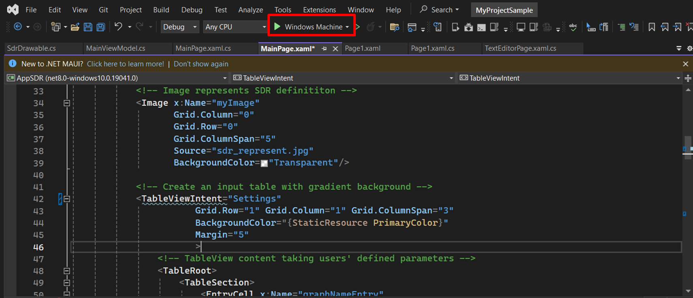
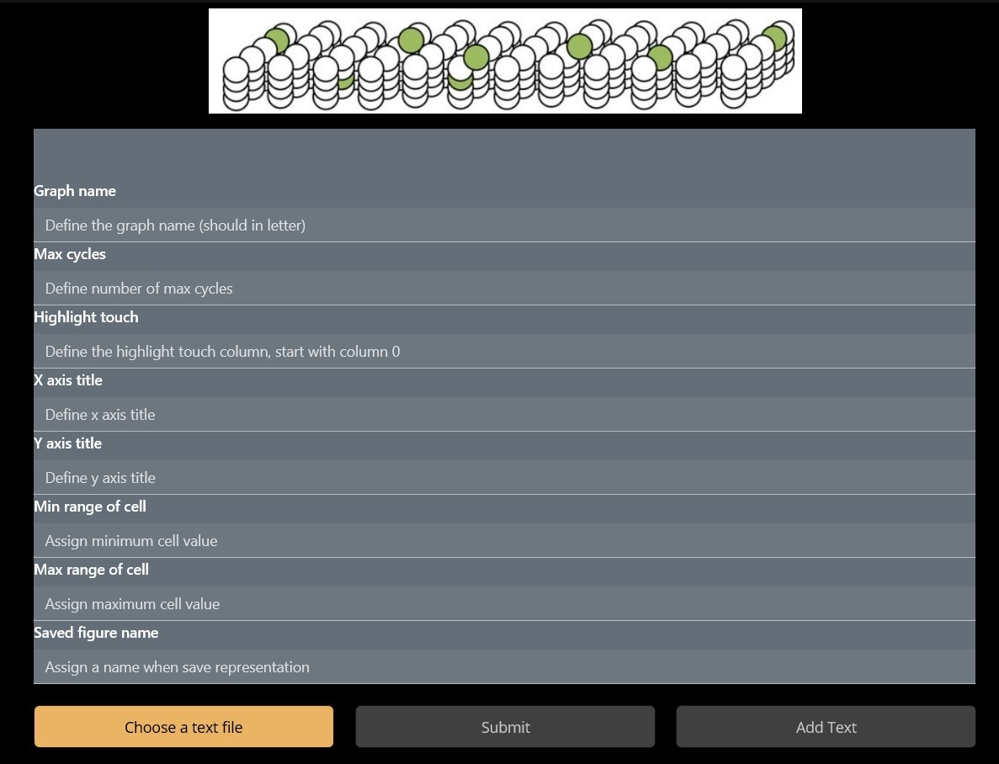
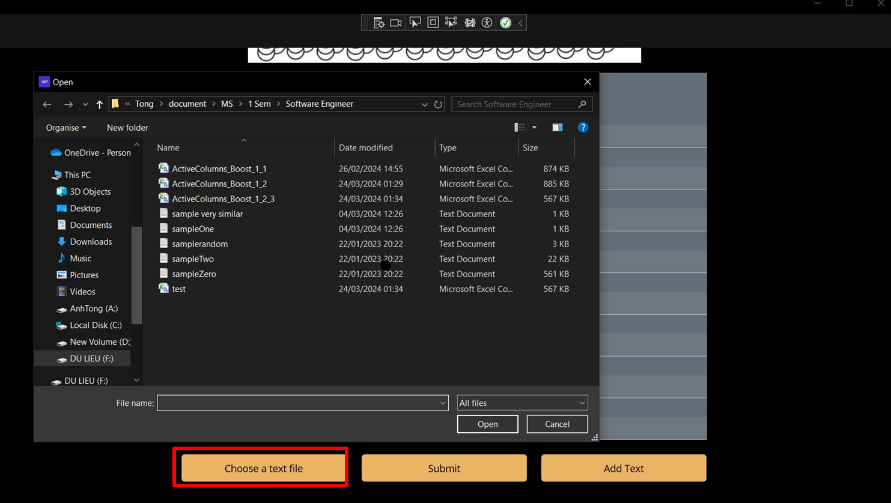
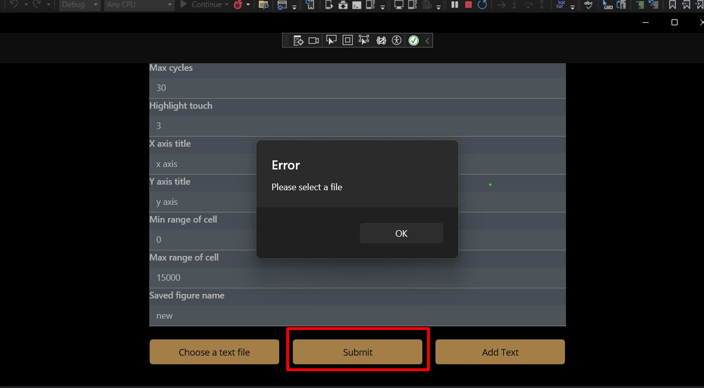
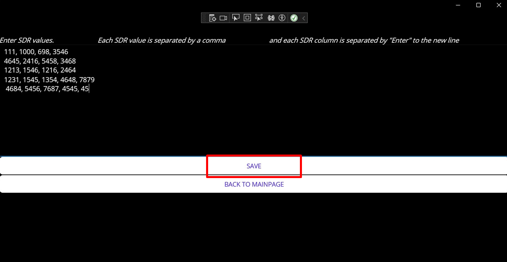
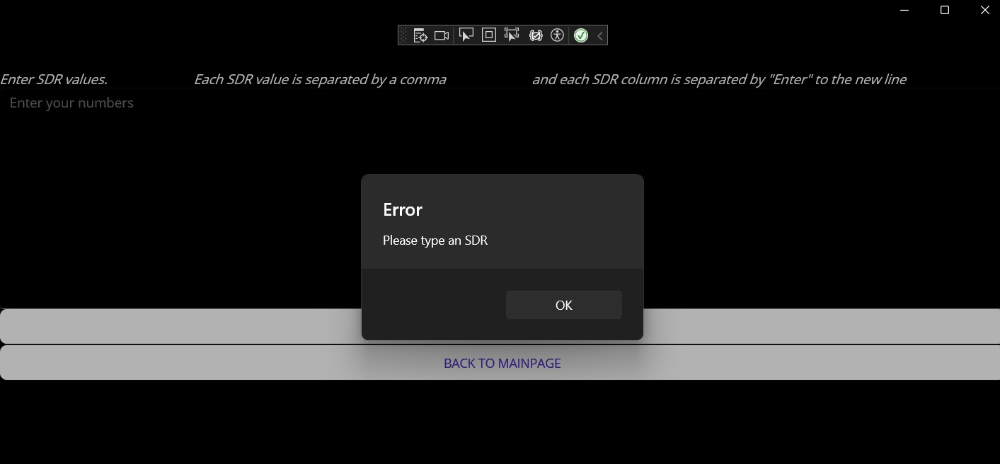
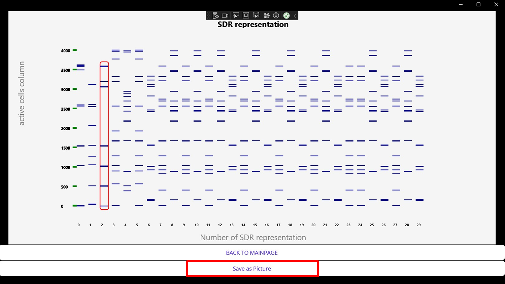
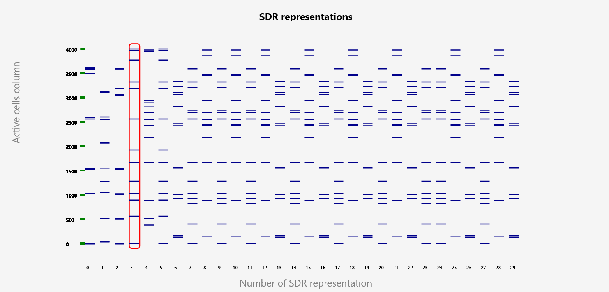

# User manual for SDR representation
This document provides detailed instructions for using the *AppSDR* in the Windows operating system. *AppSDR* is a .NET MAUI app used in Windows systems, IOS devices, and Android Emulator. The project was mainly developed on the Windows system, so the user manual contains details using steps in Windows.

## Table of contents
1. [Prequisite](#prequisite)
2. [Installation](#installation)
3. [How to run](#how-to-run)
    * [SDR values as file](#sdr-values-as-file)
    * [SDR values as text editor](#sdr-values-as-text-editor)
    * [Output representation](#output-representation)
4. [License](#license)

## Prequisite
It is advised to install the most recent versions of the IDE, text editor, and MAUI as the project incorporates the most recent update. 
* Microsoft Visual Studio Community 2022 - v17.8.6 - https://learn.microsoft.com/en-us/visualstudio/releases/2022/release-notes-v17.8 
* .NET MAUI 8.0 - select .NET MAUI interface during Visual Studio installation. It will be automatically supported with version 17.8.6 for.NET MAUI 8.0.

## Installation
Before running the project, installation is made. To install and open the project, follow the following steps.
* First, clone the project into a local device for use and testing
```
git clone https://github.com/tongngocminhanh/MAUI_App_SDR.git
```
* Second, navigate the solution directory of the app. The solution is located on *\local directory\MAUI_App_SDR\MySEProject*. 
* Open *MySampleProject.sln* with Visual Studio.
* To run or build the app with Visual Studio on a Windows device, create a folder named *Properties* and include the *launchSetting.json* file, content as follows.

```json
{
    "profiles": {
      "Windows Machine": {
        "commandName": "MsixPackage",
        "nativeDebugging": false
      }
    }
}
```
Now, the app is ready to run.

## How to run
After the installation step, the following screen is shown when opening the solution file. Because of the *launchSetting.json*, a state of *Windows Machine* is available for debugging. 

<div style="text-align:center">
  </img>
</div><br>

* When clicking the *Windows Machine* button, the AppSDR is loaded and the *Main Page* is shown. 
<div style="text-align:center">
  </img>
</div><br>

* Only button *Choose a text file* is available for clicking, because none of the needed parameters are defined. After inserting all parameters, all button works. 

* As configuration, there are two types to define the parameters. For *Graph name, Max cycles, Highlight Touch, Min range of cell, Max range of cell*, entered values are only numbers. The rest could be entered with text and number operated as string type. 

*Button *BACK TO MAINPAGE* appearing on *Page 1*, *Text Editor Page*, allows user to go back to *Main Page* from the current page. User can edit as demand, change their method of adding SDR data, configure parameters. The new inputs will be updated.

* After parameter configurations, SDR data is added. There are two ways of input, with file or keyboard inputs.

### SDR values as file

* When clicking *Choose a text file*, the app will access the local device memory (example in the figure), pop up the choosing screen, and allow the user to choose a file. The file extension of ".txt, .csv" is supported, so on the screen, only text files and csv files are shown. After choosing the file, the pop-up screen is automatically closed. 

<div style="text-align:center">
  </img>
</div><br>

* The used data includes inserted parameters and SDR values. Though all parameters are configured, the *Submit* button is available when a file chosen. The warning message is shown in that situation.  

<div style="text-align:center">
  </img>
</div><br>

* After both parameters and SDR data are inputted, click the *Submit* button and move to the visualization page - *Page 1*.

### SDR values as text editor
* Another way to input SDR values is add them directly from keyboards. When click *Add Text* button, screen moves to *Text Editor Page*.
* On this page, the screen has a blank space used for entering SDR values. Instruction is also given on the screen. Each SDR representation is in one line, separated when pressing the "Enter" button on the keyboard. Each SDR value of the representation is separated by a comma ",". An example is provided in the following figure. 

<div style="text-align:center">
  </img>
</div><br>

* If there is no text inserted, and *SAVE* button is clicked, error warning is shown.

<div style="text-align:center">
  </img>
</div><br>

* After SDR data are entered, click the *SAVE* button and move to the visualization page - *Page 1*.

### Output representation

* Both of the cases can produce the output as follows. Each SDR representation is shown as a column, containing ticks, as active cells of that. Configurations for the graph, such as name, axis titles, horizontal division, vertical division, are illustrate on the graph. A user who defines a highlight column will notice the red block around all represented values.

<div style="text-align:center">
  </img>
</div><br>

* By clicking the *Save as Picture* button, the representation is saved under the *.png* file. The figure name is defined on the UI of *Main Page*.

<div style="text-align:center">
  </img>
</div><br>

Further implementation information can be found [here](./README.md).

Description of the project is accessed [here](./ML22-23-8%20Implement%20the%20SDR%20representation%20in%20the%20MAUI%20application.docx)

## License
[MIT License](LICENSE)