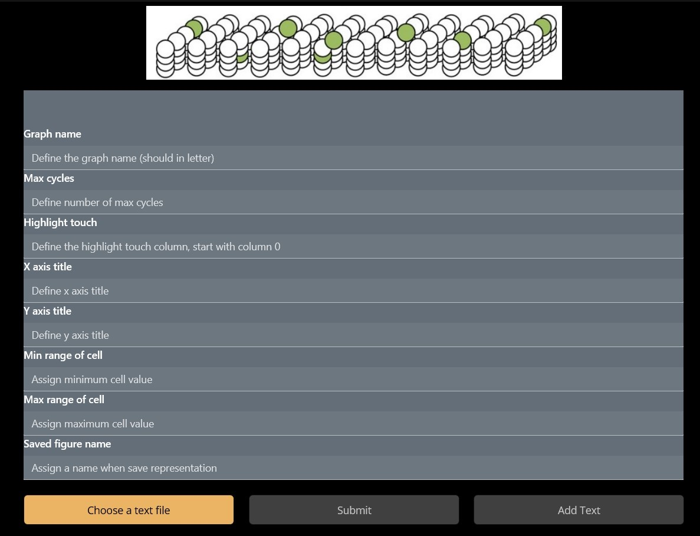
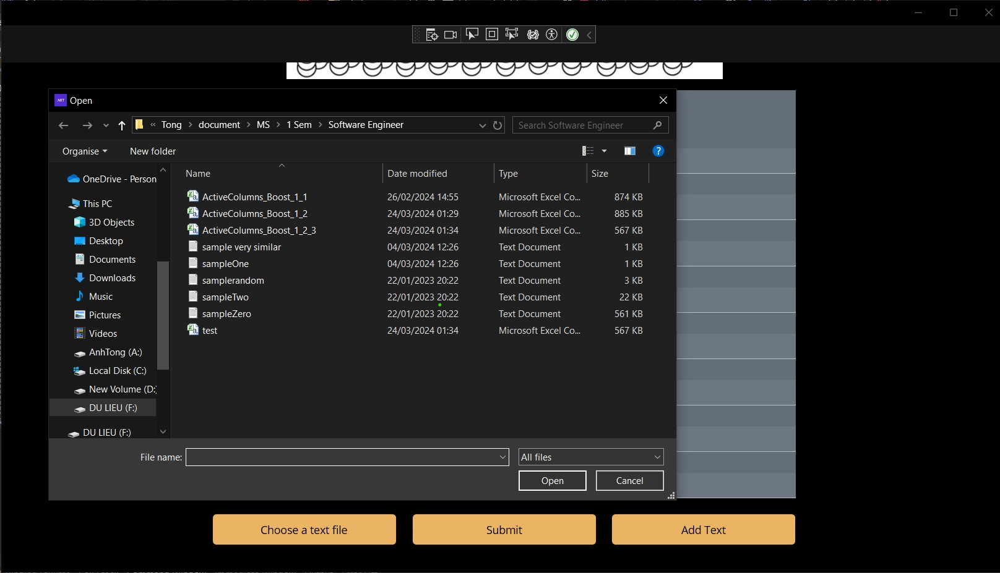
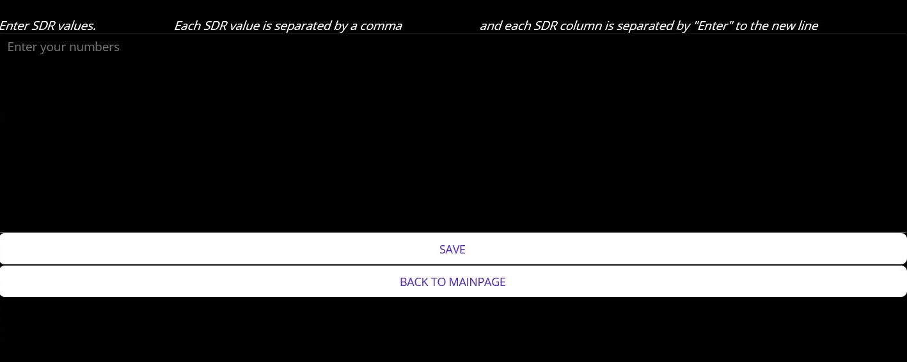
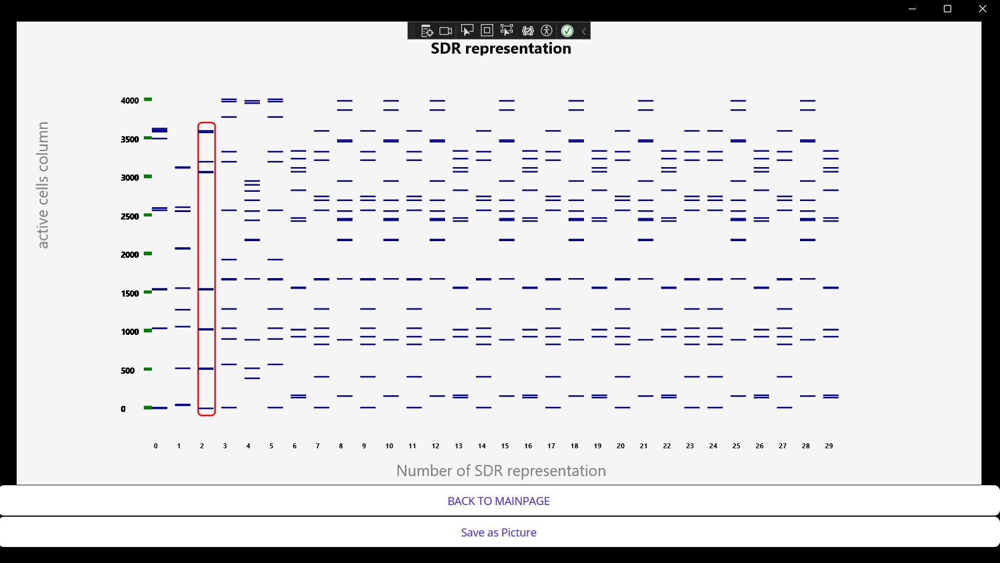
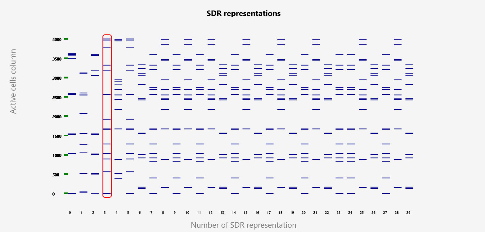

# User manual for SDR representation
This document provides detailed instructions for using the *AppSDR* in the Windows operating system. *AppSDR* is a .NET MAUI app used in Windows systems, IOS devices, and Android Emulator. The project was mainly developed on the Windows system, so the user manual contains details using steps in Windows.

## Table of contents
1. [Prequisite](#prequisite)
2. [Installation](#installation)
3. [How to run](#how-to-run)
    * [SDR values as file](#sdr-values-as-file)
    * [SDR values as text editor](#sdr-values-as-text-editor)
4. [License](#license)

## Prequisite
It is advised to install the most recent versions of the IDE, text editor, and MAUI as the project incorporates the most recent update. 
* Microsoft Visual Studio Community 2022 - v17.8.6 - https://learn.microsoft.com/en-us/visualstudio/releases/2022/release-notes-v17.8 
* .NET MAUI 8.0 - select.NET MAUI to interface with Visual Studio during installation. It will be automatically supported starting with version 17.8.6 for.NET MAUI 8.0.

## Installation
Before running the project, installation is made. To install and open the project, follow the following steps.
* First, clone the project into a local device for use and testing
```
git clone https://github.com/tongngocminhanh/MAUI_App_SDR.git
```
* Second, navigate and open the solution on the app. The solution is located on *\local directory\MAUI_App_SDR\MySEProject*. Open it with Visual Studio.
* To run or build the app with Visual Studio on a Windows device, create a folder named *Properties* and include the *launchSetting.json* file, content as follows.
```json
{
    "profiles": {
      "Windows Machine": {
        "commandName": "MsixPackage",
        "nativeDebugging": false
      }
    }
}
```

Now, the app is ready to run.
## How to run
<div style="text-align:center">
  </img>
</div><br>

### SDR values as file
<div style="text-align:center">
  </img>
</div><br>

### SDR values as text editor

<div style="text-align:center">
  </img>
</div><br>

Both of the cases can produce the output as follows. Each SDR representation is shown as a column, containing ticks, as active cells of that. Configurations for the graph, such as name, axis titles, horizontal division, vertical division, are illustrate on the graph. A user who defines a highlight column will notice the red block around all represented values.

<div style="text-align:center">
  </img>
</div><br>

By clicking the *Save* button, the representation is saved under the *.png* file. The figure name is defined on the UI of *Main Page*.

<div style="text-align:center">
  </img>
</div><br>

Further implementation information can be found [here](./README.md).

## License
[MIT License](LICENSE)